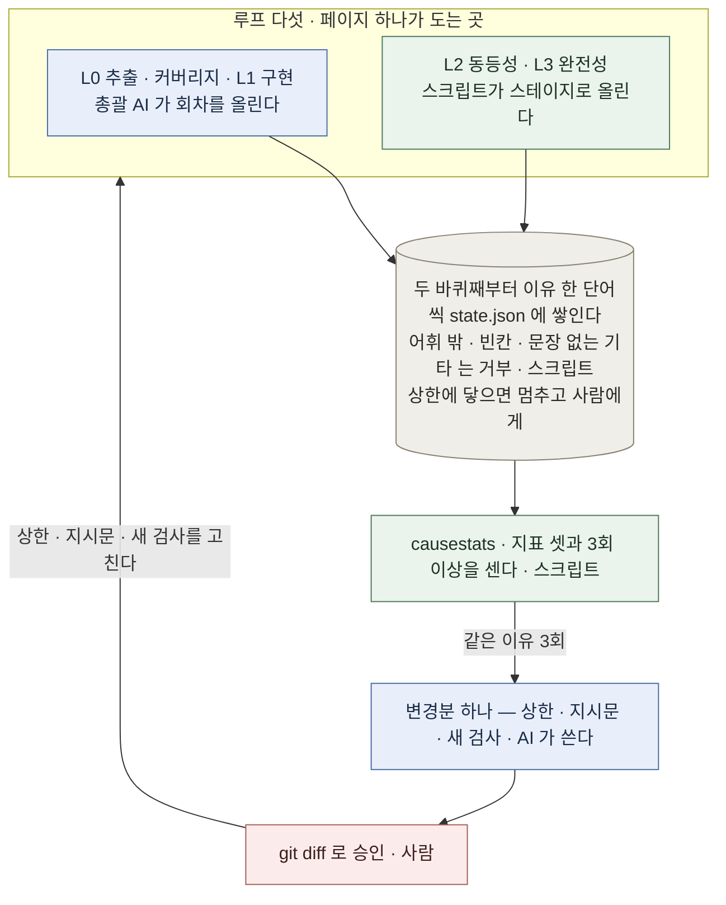

# 원인 루프 — 한 바퀴가 더 돌 때 이유를 하나 남긴다

페이지 하나를 옮기는 동안 루프 다섯이 돈다. 한 바퀴가 더 도는 것은 흔한 일인데, **그 회차가 왜 더 돌았는지는 지금까지 아무 데도 남지 않았다.** 원인 루프가 채우는 빈칸은 그것 하나다 — 회차가 올라가는 순간에 이유를 한 단어 받고, 같은 이유가 셋 쌓이면 OS 를 고친다.

> 설계 근거·결정·열린 질문의 정본은 `docs/legacy-migration-os.md` **4장**이다. 이 문서는 그림과 숫자만 담고 근거는 가리킨다. 명령의 사용법은 `pagecheck --help` · `causestats --help` 에 있다.
>
> **`docs/os-loop.md` 와의 관계.** 그 문서는 OS **전체**를 그린 그림 셋이고(v2 기준, 머리말에 v3 주의가 붙어 있다), 이 문서는 그것을 대체하지 않는다. 여기서 다루는 것은 그 전체 위에 얹힌 **더 작은 루프 하나**다.

## 무엇이 반복되고, 그 반복에서 무엇이 쌓이는가

바깥 루프의 한 바퀴는 **페이지 완주가 아니라 안쪽 다섯 중 하나가 한 바퀴 더 도는 순간**이다. 3회에 닿지 않은 이유는 아무것도 일으키지 않고 그대로 쌓인다. 그래서 이 그림에는 Phase 순서가 없다 — 순서는 `os-loop.md` 가 그렸고, 여기서 볼 것은 무엇이 반복되고 그 반복이 무엇으로 쌓이는가뿐이다.

## 병목 — 두 번째 페이지의 L2 열 바퀴

2026-09-09 회차(`docs/retrospectives/2026-09-09-second-slice-v2.md` 1·2장)에서 **L2 동등성만 10 회를 돌았다. 상한은 5 였다.** 나머지 넷의 회차는 1 · 1 · 2 · 1 이었다. 그 열 바퀴의 원인 분해는 **환경 2 · 오케스트레이터 결함 3 · 확인만 2 · 실제 이관 결함 3** 이다 — **열 중 일곱이 이관과 무관했다.** 회차는 벽시계 12.2 시간, 계산 시간 7.1 시간이었고 8 단계 중 7 단계에서 FAIL 했다.

낭비의 자리는 재시도 자체가 아니라 **재시도가 세어지지 않은 것**이다. 상한을 두 배로 넘기는 동안 그 숫자를 보는 곳이 없었고, 회고를 쓰기 전까지는 일곱이 헛돌았다는 사실도 없었다.

## 지표 셋과 기준선

| 지표 | 계산 | 기준선 |
|---|---|---|
| 이관과 무관했던 회차 비율 | (환경 + OS결함 + 확인만) / 위층이 정해진 추가 회차 | **70%** (7/10) |
| 반복 원인 수 | 3회 이상 쌓인 이유의 개수 | **2** (OS결함 3 · 이관결함 3) |
| `기타` 비율 | `기타` / 전체 추가 회차 | **0%** (0/10) |

**이 셋은 전부 손으로 센 값이다.** 위 회고의 분해표를 어휘로 옮긴 것이고 `state.json` 이 잰 것이 아니다. 지금 `causestats` 를 돌리면 종료 코드 3 으로 "설정이 가리키는 페이지 디렉터리가 없다"고 답한다 — **잴 회차가 아직 하나도 없다.**

**도구가 잰 것은 하나다.** 같은 열 바퀴를 합성 페이지로 재생해 `causestats` 에 먹였더니 `70.0%` · `2` · `0.0%` 가 그대로 나왔다. 검증된 것은 **공식**이고, 기준선이 측정된 것은 아니다. 실측값은 다음 페이지가 회차를 쌓은 뒤에 나온다.

## 속임수를 막는 장치

| 장치 | 막는 것 | 확인 |
|---|---|---|
| 이유 없이 두 바퀴째로 들어갈 수 없다 | "이유를 안 적어서 반복 원인 0" | `pagecheck --round` 종료 코드 2, 카운터도 안 올라간다 |
| 어휘 밖의 값은 거부된다 | "매번 다르게 적어 3회를 피하는 것" | 같은 종료 코드 2. `기타` 는 문장이 없으면 역시 2 |
| 상한을 바꾸면 기록에 남고 따로 보고된다 | "상한을 올려 초과율을 낮추는 것" | `cap_changes` 에 남고, `--show` 와 `causestats` 가 회차와 **분리해** 찍는다 |

셋이 같은 모양인 이유는 하나다 — 어떤 지표든 좋게 만드는 가장 싼 길은 측정 자체를 약화시키는 것이므로, 그 길을 각각 막는다. `기타` 가 첫 지표의 **분모에서 빠지는 것**도 같은 장치다: 전부 `기타` 로 적으면 0% 가 되는 것이 아니라 계산 불가가 되고, 그 사실이 그대로 보고된다.

**넷째가 있었으나 없다.** 셀프테스트의 검사를 건너뜀으로 바꿔 통과시키는 길은 CI 의 바닥(`MIN_CHECKS`)이 막고 있었고, 그 CI 를 걷어내면서 함께 사라졌다(정본 변경 이력 2026-09-15). 셀프테스트는 여전히 건너뜀을 따로 세지만 그 숫자를 읽고 빨간불을 켜는 것은 없다 — 위 셋과 달리 이 자리는 지금 비어 있다.

**셀프테스트가 재는 것은 이 OS 자신이지 이관 결과가 아니다.** 회사 설정이 없는 트리에서 43 개 검사 중 25 개가 돌고 15 개가 각자 없는 키를 말하며 건너뛴다. 이관이 검증됐다는 사실은 여전히 로컬에서만 나오고, **그것이 이 저장소의 CI 를 걷어낸 이유다** — 공개 저장소의 CI 가 돌릴 수 있는 것은 이 셀프테스트뿐이었다.
