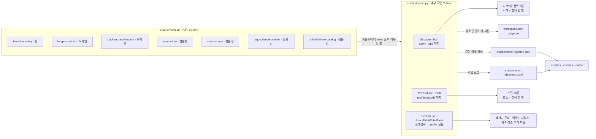

# 컨텍스트 체계

이 OS 의 지침은 `CLAUDE.md` 하나에 쌓이지 않는다. 일곱 개의 컨텍스트 파일로 쪼개져 있고, **훅이 이름·경로로 판정해 필요한 것만 결정적으로 주입한다.** 이 문서는 그 체계의 지도이고, 주입이 실제로 닿았는지 확인하는 절차와 그것을 재는 축을 함께 적는다.

왜 LLM 에게 "필요하면 읽어라"로 맡기지 않는가. 그 방식은 느리고, 비결정적이고, **빠뜨렸다는 사실이 아무 데도 남지 않는다.** 이 저장소는 그 실패를 이미 한 번 기록했다 — 느린 도구는 회피되고, 회피는 로그에서 설계 문제처럼 보인다. 훅은 ms 단위이고, 결정적이고, 주입한 것을 로그로 남긴다. **마지막 항목이 핵심이다: 주입이 결정적이 되면 주입 자체를 테스트할 수 있다.**

## 한 장 도식



세 트리거가 서로 다른 **식별 수단**에 붙어 있다는 것이 이 설계의 전부다. 이름으로 알 수 있는 것은 이름으로, 경로로 알 수 있는 것은 경로로, 둘 다로 알 수 없는 것만 스킬 이름으로 건다. 그래서 "무엇을 주입할지"를 매번 판단할 필요가 없다.

## 컨텍스트 파일

| 파일 | kind | 줄 | 바이트 | 트리거 | 소비자 |
|---|---|---|---|---|---|
| `team-boundary.md` | 팀 | 32 | 2,420 | 에이전트 9 · 경로 `${project.root}/**` (Write·Edit 만) | 모든 서브에이전트, 추적 파일을 쓰는 모든 호출 |
| `ledger-contract.md` | 도메인 | 38 | 3,612 | 에이전트 8 · 스킬 3 | 원장을 읽거나 쓰는 전부 |
| `backend-architecture.md` | 도메인 | 35 | 3,147 | 에이전트 3 · 경로 `${backend.root}/**` | 설계·구현·감사 |
| `legacy-tree.md` | 전문성 | 35 | 3,215 | 에이전트 5 · 스킬 5 · 경로 `${legacy.root}/**` | 레거시를 읽는 전부 |
| `seam-shape.md` | 전문성 | 44 | 3,403 | 에이전트 3 · 스킬 3 | 추출·스왑·감사 |
| `equivalence-oracles.md` | 전문성 | 33 | 3,396 | 에이전트 3 · 스킬 4 | 추출·스왑·코퍼스 |
| `silent-failure-catalog.md` | 전문성 | 30 | 3,652 | 에이전트 3 · 스킬 2 | 레드팀·설계·감사 |

세 분류의 뜻은 강의의 팀·도메인·전문성을 이 저장소의 축으로 옮긴 것이다. **팀** = 이 저장소에서 일하는 누구에게나 걸리는 경계, **도메인** = 이 마이그레이션의 대상이 무엇인지에 대한 합의, **전문성** = 특정 도구·기법을 쓸 때만 필요한 판독 규칙.

두 가지 규율이 파일 안에 걸려 있다. **60줄 이내**이고 **원칙과 판정 규칙만** 담는다. 살아있는 규칙은 옮겨 적지 않고 설정 키 이름으로 가리킨다 — `backend-architecture.md` 가 계층 규칙을 한 줄도 옮겨 적지 않는 이유가 그것이다. 첫 실행 뒤에 그 규칙이 실제로 뒤집혔고, 사본은 사실보다 오래 산다.

## 주입 형식과 중복 억제

주입되는 것은 파일 본문을 감싼 블록이다.

```
# 자동 주입된 컨텍스트 — `.claude/context/` (트리거: agent · 세션·에이전트당 파일 1회)

<context name="legacy-tree" kind="전문성" token="CTX-LEGACY-TREE-7f3a">
...본문...
</context>
```

`token` 은 **주입이 실제로 닿았는지 확인하기 위한 고유 문자열**이다. 로그에 "주입했다"고 적히는 것과 모델이 그것을 보는 것은 다른 사실이고, 이 토큰이 그 둘을 가른다.

중복 억제 키는 `(세션, 에이전트, 파일)` 이다. 같은 조합에는 다시 주입하지 않는다. 컨텍스트는 쓸수록 썩는 유한 자원이고, 같은 문단을 스무 번 넣는 것은 그 자원을 태우면서 아무것도 더 알려주지 않는다. 억제된 횟수는 로그가 아니라 상태 파일에 센다 — 로그는 "무엇이 주입됐는가"여야 하고, 억제가 로그의 대부분을 차지하면 로그가 자기 목적을 잃는다.

## 프로브 절차 — 주입이 정말 닿았는가 (도전 1)

`SubagentStart` 훅의 출력 형식은 문서에 명시돼 있지 않다. 그래서 이 OS 는 **두 형식을 모두 구현해 두고 상수 하나로 고른다**(`context-inject.py` 의 `SUBAGENT_OUTPUT`), 그리고 어느 쪽이 맞는지는 추론이 아니라 실측으로 정한다. 셋 다 안 되면 `TASK_FALLBACK = True` 로 `PreToolUse(Task)` 에서 프롬프트에 덧붙이는 경로가 남아 있다.

**훅은 세션 시작 시점에 스냅샷된다.** 방금 등록했다면 이 세션에서는 발동하지 않는다. 프로브는 반드시 새 세션에서 돈다.

1. `settings.json` 등록을 마치고 **새 세션**을 연다.
2. `.claude/scripts/ctxstats --probe` — 무엇을 물어야 하는지(에이전트별 기대 토큰)를 찍는다. 아직 주입이 없으면 라우팅 표만 나온다.
3. 대상 서브에이전트를 하나 띄우고 프롬프트 끝에 이렇게 붙인다: **"응답 첫 줄에, 너에게 자동 주입된 `<context ...>` 블록의 `token` 값을 전부 그대로 나열하라. 하나도 없으면 `없음` 이라고 답하라."**
4. 답을 `.claude/.state/context-probe.jsonl` 에 한 줄로 적는다.
   ```
   {"ts":"2026-09-09T10:00:00+09:00","session":"<session id>","agent_type":"php-behavior-analyst","reported":["CTX-LEDGER-CONTRACT-2c8d","CTX-LEGACY-TREE-7f3a","CTX-TEAM-BOUNDARY-4b19"]}
   ```
5. `ctxstats --probe` 를 다시 돌린다. 기대와 보고를 대조해 `확인` / `미확인` / `불일치` 를 낸다. 미확인이 있으면 exit 1.
6. 미확인이면 `SUBAGENT_OUTPUT` 을 `"stdout"` 으로 바꿔 2–5 를 반복하고, 그래도 안 되면 `TASK_FALLBACK = True` 로 한 번 더 반복한다. **결과를 이 문서의 아래 표에 적는다.**

| 시도 | 형식 | 결과 | 측정일 |
|---|---|---|---|
| 1 | `SUBAGENT_OUTPUT = "json"` | 미측정 | — |
| 2 | `SUBAGENT_OUTPUT = "stdout"` | 미측정 | — |
| 3 | `TASK_FALLBACK = True` | 미측정 | — |

**"미측정"을 "동작함"으로 바꿔 적지 않는다.** 주입 로그에 줄이 남는 것은 이 훅이 stdout 에 무엇을 썼는지를 증명할 뿐, 그것이 모델의 컨텍스트에 닿았는지는 증명하지 않는다. 스킬·경로 트리거(`PreToolUse` 의 `additionalContext`)는 문서화된 경로라 같은 의심이 없다.

## A/B 절차 — 컨텍스트가 스킬 동작을 바꾸는가 (필수 2)

대상은 `php-legacy-io` 다. 컨텍스트 유무로 결과가 가장 선명하게 갈리는 스킬이기 때문이다 — 인코딩 판독 규칙이 없으면 범용 도구로 파일을 읽고, 그 손실은 아무 표시도 남기지 않는다.

eval 세트는 `.claude/skills/php-legacy-io/evals/` 에 있다(`skill-creator` 형식, 합성 픽스처, 회사 정보 없음). 실행은 사용자가 한다.

1. **B(주입 없음)**: `CONTEXT_INJECT_OFF=1 claude` 로 세션을 열고, `/skill-creator` 로 `php-legacy-io` 의 eval 을 돌린다. 훅이 스스로 "꺼져 있다"고 stderr 에 말하므로 B 라는 사실이 기록에 남는다.
2. **A(주입 있음)**: 환경변수 없이 새 세션을 열고 같은 eval 을 같은 조건으로 돌린다.
3. 두 실행의 `benchmark.json` 을 나란히 놓고 pass rate·토큰·시간을 비교한다. `ctxstats --all` 로 A 쪽 세션의 주입 건수·바이트를 확인해 **A 가 정말 A 였는지** 확인한다. 주입 0건이면 그 A 는 A 가 아니다.

가장 중요한 판정은 pass rate 가 아니라 **어떤 assertion 이 갈렸는가**다. 양쪽에서 똑같이 통과하는 assertion 은 이 스킬의 값을 재지 못한다.

## 정량 축 (도전 2)

`ctxstats` 가 재는 세 축이다.

**주입 바이트 — 전역 주입 대비.** 일곱 파일을 전부 `CLAUDE.md` 에 넣으면 모든 세션이 **22.8KB** 를 무조건 문다. 훅 주입은 서브에이전트가 시작할 때 그 에이전트에게 필요한 것만 문다.

| 소비자 | 파일 | 주입 바이트 | 전역 대비 |
|---|---|---|---|
| `domain-scribe` | 2 | 6,034 | **−74%** |
| `backend-slice-implementer` | 3 | 9,182 | −60% |
| `php-behavior-analyst` | 3 | 9,250 | −60% |
| `php-seam-extractor` | 4 | 12,438 | −46% |
| `php-swap-engineer` | 5 | 16,051 | −30% |
| `domain-boundary-auditor` | 6 | 19,455 | −15% |
| **에이전트 9종 평균** | 3.8 | **11,953** | **−48%** |
| 메인 세션(트리거 전) | 0 | **0** | −100% |

감사자가 −15% 에 그치는 것은 설계대로다. 두 저장소를 다시 읽고 판정하는 역할이라 거의 모든 축이 필요하다. **이 표의 값은 "적을수록 좋다"가 아니라 "역할이 필요로 하는 만큼인가"로 읽는다.**

**트리거별 분포.** 세 축 중 하나가 0 이면 그 축의 배선이 끊긴 것이다. `ctxstats` 는 0인 축에 그렇다고 표시한다.

**중복 억제율.** 억제가 없으면 레거시 파일 스무 개를 읽는 에이전트가 `legacy-tree.md` 를 스무 번, 64KB 받는다. 억제가 걸리면 3,215B 한 번이다. `ctxstats` 는 `트리거 매치 / 주입 / 억제 / 억제율` 을 함께 찍는다. 억제율이 0% 이면 같은 문단이 반복 주입되고 있다는 신호다.

측정은 강의가 준 절차를 따른다 — `/clear` 직후 `/context` 로 기저값, 스킬 실행 뒤 다시, 최적화 뒤 다시. `CLAUDE.md` 슬림화의 효과는 그 세 수치로 재고, 주입 쪽 효과는 위 표와 `ctxstats` 로 잰다.

## 운영 메모

**등록.** `settings.json` 의 `SubagentStart` 전체, `PreToolUse` matcher `Skill`, `PreToolUse` matcher `Read|Edit|Write|Bash` 세 자리다.

**설정이 없으면 경로 트리거만 꺼진다.** 에이전트·스킬 트리거는 설정을 읽지 않으므로 계속 돈다. 꺼졌다는 사실은 세션마다 한 번 stderr 로 말한다 — 조용히 좁아진 동작이 이 저장소가 반복해서 기록한 실패 모양이다.

**이 훅은 어떤 경우에도 도구를 막지 않는다.** 컨텍스트 파일 하나가 깨져도 나머지는 주입되고, 무엇이 깨졌는지만 stderr 로 나온다. 형식 검증은 훅이 아니라 검사기가 한다: `python3 .claude/hooks/context-inject.py --check [--strict]` — 0 깨끗, 1 이름 어긋남(strict), 2 프론트매터를 읽을 수 없음.

**검증.** `python3 .claude/scripts/selftest_context.py [--strict]` 가 라우팅·억제·로그·치환·출력 형식·안전성·이름 정합을 합성 훅 입력으로 확인한다. 컨텍스트 파일이나 훅을 고친 뒤에는 이것을 돌린다.
