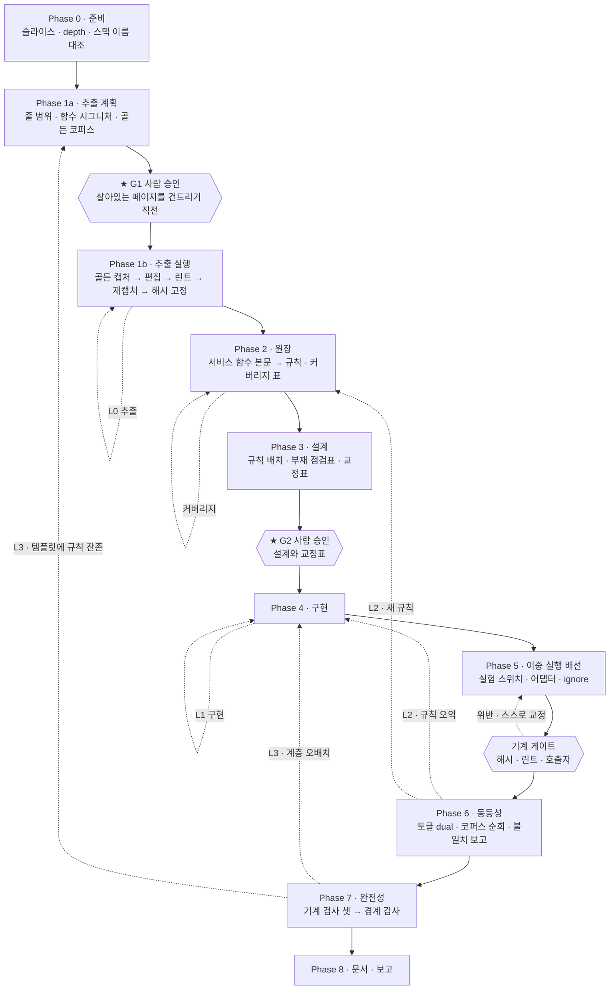

# 레거시 마이그레이션 OS 설계

- 상태: **v3 축소 개정 (2026-09-11) — 이음새의 높이는 v2 그대로 두고, 작업 단위를 이음새 함수 하나로 내리고 고정 비용을 영역 단위와 스크립트로 옮긴다. 근거는 두 번째 슬라이스의 실패가 아니라 1.6장의 진단 셋이다. v3 는 아직 실행 전이다**
- 대상: 프론트엔드와 백엔드가 분리되지 않은 레거시 PHP 서비스의 백엔드를 Spring/Kotlin 으로 슬라이스 단위 이관
- 구성 요소: 마이그레이션 스킬 11개, 서브에이전트 9개(v3 에서 8개로 병합), 훅 5개, 레거시·관찰 도구 11개(v3 가 `slicecheck` 를 더한다), 컨텍스트 파일 7개 (저장소에는 이 OS 와 무관한 범용 스킬 `goal-loop`·`interview`·`git-commit`·`skill-stat` 도 있다 — `goal-loop` 은 정량 목표 하나를 수렴시키는 별개 오케스트레이터이고 이 파이프라인과 공유하는 것은 저널·상한·일방향 흐름의 패턴뿐이다)

이 문서는 살아있는 설계 문서다. 설계가 바뀌면 여기를 먼저 고치고 구현을 따라오게 한다.
결정마다 상태(합의 / 잠정 / 검토 중)와 근거를 남기는 이유는, 나중에 바꾸려는 사람이
"왜 이렇게 됐는지"를 몰라 같은 함정을 다시 밟는 걸 막기 위해서다.

## 1. 풀려는 문제

레거시 PHP 는 화면과 업무 로직이 한 파일에 섞여 있다. 이걸 한 번에 옮기는 대신,
백엔드에 해당하는 부분만 Spring 으로 떼어내고 PHP 가 그것을 호출하게 바꾼다. 화면은 그대로
두므로 기존 동작이 곧 정답지가 된다.

그런데 이 전환에는 확인해야 할 것이 **두 가지**인데 흔히 하나만 확인한다.

| 질문 | 답할 수 있는 것 |
|---|---|
| 이관 전후 동작이 같은가 | 동등성 오라클 — v1 은 e2e, v2 는 이중 실행 |
| 도메인 로직이 실제로 다 옮겨갔는가 | **동등성 오라클로는 답할 수 없다** |

두 번째가 답이 안 되는 이유는 구조적이다. PHP 가 규칙을 여전히 계산하고 새 백엔드에는
데이터만 요청해도, 화면에 찍히는 결과는 완전히 이관된 경우와 동일하다. e2e 는 화면만
관찰하므로 둘을 구분하지 못한다. 슬라이스가 green 인 채로 절반만 이관된 상태가 나온다.

이 논증은 오라클을 바꿔도 살아남는다. v2 의 이중 실행은 화면이 아니라 값을 보지만, **값이 어디서 계산됐는지는 여전히 안 보인다.** PHP 가 규칙을 계산해 넘긴 값과 백엔드가 계산해 돌려준 값이 같으면 EQUAL 이고, 그것이 정확히 첫 실행에서 일어난 일이다(1.5장).

## 1.5 v2 — 왜 세 높이인가 (2026-09-08)

v1 은 1장의 두 질문을 정직하게 나눴는데, **나눈 뒤 세 장치를 서로 다른 높이에 두었다.**

| 장치 | v1 의 높이 |
|---|---|
| 관찰(동등성) | **화면** — 브라우저가 보는 HTML |
| 도메인 경계 | **페이지 스크립트** — 규칙이 실제로 사는 곳 |
| 교체 이음새 | **데이터 접근 계층** — 우리가 바꾼 곳 |

세 높이가 다르면 각 높이 사이의 틈을 메우는 장치가 따로 필요해진다. v1 의 보상 장치는 셋이었다 — 화면에서 보이지 않는 규칙을 위한 `불가` 행, 같은 spec 을 토글 양쪽에서 두 번 도는 2패스 스위트, 그리고 두 저장소를 사람(에이전트)이 다시 읽는 감사. 첫 실행의 비용·느림·불투명함은 거의 전부 이 셋이었다.

그리고 셋을 다 갖추고도 못 잡는 것이 있었다. 첫 실행의 감사가 낸 **유일한 FAIL 사유**가 그것이다 — 모바일 호출부 세 파일이 이음새로 보내는 페이징 창을 각자 다르게 계산하는데, 그 중 하나는 앞 줄에서 대입한 값을 페이지 크기 자리에 다시 써서 창이 페이지마다 넓어진다. 어느 페이지에서도 도달할 수 없는 행 구간이 생긴다. 그 규칙은 원장에 없었고, 이관되지도 잔류 승인을 받지도 않은 채 새 경로를 탔다.

**DAO 이음새의 이중 실행으로는 이것을 영원히 못 잡는다.** 규칙이 이음새 **위**에 있어서 레거시 경로와 새 경로가 **같은 잘못된 입력**을 받기 때문이다. 두 값이 항상 같으니 비교는 언제나 EQUAL 이고, 화면도 같으니 e2e 도 초록이다. 오라클은 자기 **아래**만 본다 — 비교의 위치가 비교의 내용을 정한다.

### v2 — 세 높이를 서비스 함수 하나로 맞춘다

- **이음새** = 페이지마다 하나씩 만드는 PHP 서비스 함수. 입력은 요청 파라미터·세션 값·상수, 출력은 템플릿이 바인딩할 데이터 배열이다. 페이지 스크립트에는 `include → 가드 → 파싱 → 서비스 호출 → 바인딩 → 템플릿 include` 만 남는다.
- **관찰** = 그 함수 **안**에서의 이중 실행. 레거시 본문과 새 백엔드 호출을 한 요청에서 둘 다 실행해 비교하고, 화면에는 **항상 레거시 값을 돌려준다.** 불일치는 입력과 함께 JSONL 한 줄로 남는다. 추출 자체(PHP 내부 리팩터)의 오라클은 골든 마스터 — 편집 전후 응답 바이트 비교다.
- **완전성** = 페이지 스크립트의 **구조 린트**(허용 모양 밖의 문장이 있는가) + 옮긴 레거시 본문의 **해시 고정** + **호출자 전수**(이음새 밖에서 그 메서드를 부르는 곳이 있는가). LLM 감사는 그 셋이 통과한 뒤 분류와 배치 판단만 진다.

### 보상 장치 셋이 어떻게 사라지는가

- **`불가` 행.** 첫 실행의 11행 중 가장 큰 묶음이 "관측 창이 없다" — 탭 건수의 실제 숫자, 정렬용 순번 값, DB 가 돌려주는 원본 순서가 어느 화면에도 나오지 않았다. 이중 실행이 보는 것은 화면이 아니라 **함수의 반환값**이라 그 값들이 그대로 비교 대상이 된다. 남는 `불가` 는 종류가 다르다 — 그 입력을 만들 데이터가 없어 **실행 자체가 안 되는** 것이고, 그건 원장의 새 절 `필요 픽스처` 가 진다.
- **토글 2패스 스위트.** 두 패스가 서로 다른 시각의 살아있는 데이터 위에서 돌아서, 차이가 이관 결함인지 데이터 변화인지 갈리지 않았다. 이중 실행은 **한 요청 안에서** 두 경로를 돌리므로 입력도 시각도 같다. 패스가 하나가 되고, 데이터 변동이 차이로 오지 않는다.
- **두 저장소 재독 감사.** 완전성 질문의 기계적인 절반이 세 검사로 내려간다. 첫 실행이 감사에 3회차를 쓰고도 상한에 닿은 이유는 매 회차가 앞 회차를 믿지 않고 근거를 다시 세웠기 때문인데, 해시와 린트와 호출자 전수는 다시 세울 것이 없다. 감사가 남는 자리는 "이 규칙이 도메인인가 화면인가", "이 배치가 맞는가" 뿐이다.

### 무엇을 지불하는가

**살아있는 페이지 스크립트를 직접 편집한다.** v1 은 DAO 메서드 안쪽만 건드렸고 화면·템플릿·진입점 수정이 0 이었다. v2 는 그 성질을 포기한다. 그래서 사람 게이트가 Phase 5 에서 Phase 1 로 앞당겨지고(D-23), 편집이 동작을 바꾸지 않았음을 증명할 오라클(골든 마스터)이 새로 필요해진다.

**골든 마스터는 데이터가 흔들리면 못 쓴다.** 로컬 스택의 DB 는 원격이다 — compose 에 DB 컨테이너가 아예 없고 자격증명이 바깥을 향한다. 목록 페이지는 다른 팀이 글을 쓰면 바로 바뀌므로 구조 모드(텍스트 제거)로만 비교할 수 있고, 고정 식별자 상세 페이지가 우선 표적이 된다. 즉 `environment-readiness.md` 의 조치 B(통제된 로컬 DB)와 픽스처가 "미루는 것"에서 **선행 조건**으로 올라왔다.

**쓰기 슬라이스는 미해결이다.** 이중 실행은 후보 경로에 부작용이 없어야 성립한다. 첫 슬라이스가 읽기 전용이라 공짜로 얻은 성질이고, 쓰기에서는 이중 실행이 데이터를 두 번 바꾼다. 지금 이 설계는 읽기 슬라이스의 설계다.

**운영 shadow 는 이 OS 의 범위 밖이다.** 이중 실행을 운영 트래픽에 켜는 것이 이 패턴의 원래 쓰임이고 입력 분포도 그쪽이 진짜다. 그러나 지연이 직렬로 더해지고(첫 실행 실측 — 어댑터 총 타임아웃 10초, 한 페이지가 최대 3회 호출), 로그가 새로운 관찰 가능 동작이 된다. 이 OS 는 로컬 코퍼스에서만 돌리고, 운영에서 켜는 것은 슬라이스가 끝난 뒤 팀이 정한다.

### 유지하는 것

두 질문을 다른 오라클에 묻는다는 원칙(D-01), 조인 키로서의 행위 원장(D-02), 사람 게이트 2개(D-04), 결함 교정 기본값과 `의도수정`(D-15), 환경변수 스위치와 "값이 없으면 레거시"라는 fail-safe(D-06 의 남은 절반), 공개 저장소와 비공개 대상의 분리(D-05), 인코딩을 아는 도구들. v2 는 이 위에서 **높이만** 바꿨다.

## 1.6 v3 — 왜 축소인가 (2026-09-11)

v2 는 두 번째 슬라이스에서 Phase 7 감사 FAIL 로 끝났고, 그 실패의 원인은 회고가 적었다. 이 절이 답하는 것은 다른 질문이다: **회차가 왜 길었고, 그 길이가 구조의 어디에서 오는가.** 사용자는 회차가 너무 길다고 지적했고 두 번째 슬라이스를 중간에 끊었다. 그 판단을 여기서 설계로 옮긴다.

### 진단 셋

**하나. 한 회차의 비용이 슬라이스 크기와 무관하게 Phase 일정으로 고정되어 있다.**

| 측정 | 값 |
|---|---|
| 에이전트 파견 (depth `normal`) | 11회 |
| 에이전트 파견 (depth `shallow`) | 10회 |
| `legacy-slice/SKILL.md` 중 크기 불변 서술 | 약 57% (323줄 중 약 183줄) |
| 위성 스킬까지 합친 읽기 경로 중 크기 불변 | 약 90% (2,013줄 중) |

한 페이지·한 규칙 슬라이스의 정직한 최소 경로는 18단계·7파견인데, 지금 텍스트에는 **그 축소를 선언할 방법이 없다.** `depth` 는 크기 제어 장치로 설계됐지만(D-21) 레드팀 라운드·migrated 골든·Playwright 셋만 빼고 고정 비용에는 손대지 않는다. 그래서 "슬라이스를 작게 자르면 고정 비용을 두 번 낸다"는 반론은 **지금 모양 안에서만 참이고, 고칠 것은 슬라이스 크기가 아니라 고정 비용이 놓인 자리다.**

**둘. 장치가 근거보다 먼저 자랐다.** v2 전체가 2026-09-09 01:13~01:51 에 18개 커밋으로 들어가고 01:56 에 실행이 시작됐다. 한 번도 돌려보지 않은 채 완성된 뒤 5분 만에 실전에 들어간 것이다. 그날 새로 쓴 분량은 약 7,800줄이고(회사 체크아웃에서 옮겨온 3,528줄은 제외), 그것을 정당화한 근거는 첫 실행의 감사 FAIL 하나였다. 이 문서 자신이 "닫은 것 중 어느 것도 v2 를 돌려서 닫은 것이 아니다"(10장)라고 적었고 첫 회고는 "없앨 것은 없다"로 끝났다. 두 문장이 함께 서 있으면 OS 는 단조 증가한다.

**셋. 회차가 회차를 가르치지 않는다.** 두 실행에서 나온 교훈 31개 중 다음 실행이 실제로 읽는 자리(에이전트·스킬·컨텍스트·스크립트·셀프테스트)에 도달한 것은 11개다. 나머지 15개는 회고와 인수인계 산문에만 있고, 사람이 그 문서를 열기로 마음먹지 않으면 없는 것과 같다. "다음 슬라이스의 `depth` 를 정할 때 물어볼 곳이 여기뿐"이라고 스킬이 적어 둔 `meta.json` 의 회차 기록조차 읽는 소비처가 없다. 원격 측정 파일 여섯은 보고서 셋을 만들지만 어느 것도 스킬·에이전트·게이트·설정을 바꾸지 않는다. 지금의 학습 장치는 사람이 산문을 고치는 것이고, 그래서 실패마다 "첫 실행에서 …" 절이 늘어난다.

그리고 **비용을 쓴 곳과 결함을 잡은 곳이 다르다.** 두 번째 슬라이스에서 결함을 잡은 것은 이중 실행 셋·migrated 골든 둘·감사 하나이고, 기계 게이트 셋은 거짓 통과가 한 번도 없었다. 판단 중심의 초반 단계가 253 KB(원장 115 · 이음새 계획 61 · 설계 77)를 만들었으나 그것이 잡았다고 기록된 결함은 없다. 감사가 잡은 하나는 스키마 필드 목록과 어댑터 요청 필드 목록의 차집합, 곧 스크립트 한 줄이었다. 규율 5("기계가 답할 수 있는 질문을 에이전트에게 시키지 않는다")를 어긴 자리가 회차를 가장 크게 늘렸다.

### 외부 근거 (2026-09-11 조사)

| 출처 | 이 설계에 주는 것 |
|---|---|
| Anthropic, 마이그레이션 키트와 사례 (2026-07) | 구조 보존 마이그레이션의 단위는 파일 하나. "코드를 고치지 말고 코드를 만든 과정을 고쳐라. 개별 실패는 수정 담당이 소진하고, 반복된 실패가 규칙을 기소한다." 개정된 규칙이 건드린 파일만 다시 생성한다. 개정은 사람 앞에 줄 서고 에이전트가 스스로 적용하지 않는다. 심판은 고의로 깨뜨린 코드로 먼저 검증한다 |
| Anthropic, 장기 실행 에이전트 하네스 (2025-11) | 세션당 기능 하나. 상태는 JSON 목록에 두고 에이전트는 상태 필드만 뒤집는다(모델이 JSON 을 Markdown 보다 덜 덮어쓴다). 진행 파일과 git 로그를 세션 시작에 읽는다 |
| Anthropic, 장기 실행 앱 하네스 (2026-03) | 계획자·생성자·평가자 삼분할. "일한 에이전트와 판정하는 에이전트를 나누는 것이 강한 레버." 생성 단위는 늘렸어도 **독립 평가자·사전 명세·파일 인계는 유지**했다 |
| Claude Code 서브에이전트 문서 | "여러 Phase 가 상당한 컨텍스트를 공유하면, 예컨대 계획·구현·테스트라면, 메인 대화에서." 우리 Phase 2~4 가 그 모양이다 |
| Google, 대규모 ID 확장 (FSE 2025) | 비용 오름차순 검증 사다리 여섯. 그중 둘이 완전성을 묻는다 — **AST 가 원본과 같으면 무효**, **이 변경이 필요했는지 모델에 되묻기**. 프롬프트는 12개월 고정이고 쌓인 것은 판정된 잔여 위치의 설정 파일이다 |
| VB6→C# ERP 사례 (2026-08) | 단위가 커질수록 동등성이 92%→81%→47%. 비용은 초선형(저 $1.66 대 고 $10.28)이고 입력 토큰이 99.6%. 실패 유형은 인접 모듈 누락과 다단계 흐름의 중간 생략 |
| Evo-Harness (2026-08) | **자가 생성 피드백은 진화하지 않은 기준선보다 나쁘다**(63.67→61.67). 근거 있는 환경 신호만 하네스 진화를 가능하게 한다. 교훈 항목은 `(lesson, trigger, evidence, scope)`, 진화자 연산은 `{Add, Merge, Revise, Skip}` |
| ACE (ICLR 2026) · misevolution (ICLR 2026) | 통째로 다시 쓰면 세부가 붕괴한다. 증분 델타로만 갱신한다. 기억이 쌓이면 안전성이 떨어질 수 있으므로 사람의 감독은 개선 루프 **밖**에 둔다 |
| Temporal (2026) | 축적된 산문은 약 한 달이면 썩는다. 만료 조건 없는 축적 장치를 만들지 않는다 |
| SWE Refactor Bench (2026-08) | 동작을 보존하며 마이그레이션을 건너뛴 30/520 을 기전 감사만 잡았다. 고정 테스트를 다 통과한 제출물의 68.2% 가 한 시간짜리 적대적 검증에 깨졌다 |

가설에 불리한 증거도 남긴다. Anthropic 의 2026-03 하네스는 모델이 좋아지자 생성 단위를 늘리고 평가를 끝으로 몰았다. Google 은 숙련이 쌓이자 단위를 키웠다. 7시간 실행 한 번의 FAIL 은 모양의 증거가 아니다. 그래서 **축소의 근거는 그 실패가 아니라 진단 셋이고, 작은 단위는 출발점이며 잘 되면 키운다**(D-31).

### v3 — 무엇을 바꾸는가

다섯이다.

**하나. 작업 단위를 이음새 함수 하나, 곧 페이지 하나로 내린다**(D-24). v2 의 슬라이스 단위 규칙 "대상 메서드를 부르는 페이지 전부"(7장)의 정확성 근거는 둘이었다. 진입점 밖 호출자가 있다는 것, 그리고 같은 메서드를 정반대 페이징 계약으로 쓰는 호출자가 있어 "백엔드가 정상 해석하면 모바일이 조용히 깨진다"는 것. **두 번째는 교체 지점이 데이터 접근 계층 하나였던 v1 에서만 성립한다.** v2 는 페이지마다 자기 이음새 안에서 교체하므로 한 페이지를 옮겨도 다른 호출자는 레거시 본문으로 계속 돈다. 남는 근거는 "백엔드 API 를 설계할 때 호출자 전부를 알아야 한다"이고, 그것은 `slice-scout` 단계의 `phpseam callers` 한 번으로 충족된다. 호출자 전수는 여전히 필수이지만 **그것은 이제 슬라이스 목록이 아니라 영역 API 설계의 입력이다.**

**둘. 비싼 산출물을 영역 단위 살아있는 문서로 올린다**(D-25). 첫 페이지가 영역의 자원 모양·에러 매핑·인가·계층 배치를 정하고, 다음 페이지는 델타만 낸다. 도메인 문서는 이미 영역 단위로 제자리 개정된다. 이것이 고정 비용 반론을 해소하는 본체다.

**셋. 기계 절차를 스크립트로 내린다**(D-26). 환경 검증·잡음 바닥 측정·토글 전환·캡처·집계·비교·독 주입·복귀는 판단이 아니다. `slicecheck` 한 명령이 단계로 돌리고 `state.json` 에 회차와 상한과 게이지를 쓰며, 상한에 닿으면 멈추고 사람에게 보고한다. 오케스트레이터는 숫자만 읽는다. 두 번째 슬라이스에서 이 절차를 손으로 돌린 것이 오케스트레이터 시간 2.1시간의 큰 몫이었고, L2 가 상한의 두 배를 돈 사실을 아무도 보지 못한 이유도 카운터가 없었기 때문이다.

**넷. 사이에서 결함이 샌 두 역할을 합친다**(D-27). 두 번째 슬라이스를 FAIL 시킨 결함은 구현자와 스왑 담당 사이에 있었고 한 회차에 두 번 나왔다. 스키마 필드는 구현자의 산출물이고 어댑터 요청 필드는 스왑 담당의 산출물인데 둘을 함께 보는 독자가 없었다. 합치고, 그래도 `phpseam fields` 로 기계가 본다.

**다섯. 회차가 회차를 가르치는 장치를 넣는다**(D-28, D-29). 역할별 저널은 근거 경로를 인용한 항목만 받고, 슬라이스가 끝나면 그 항목에서 컨텍스트 파일에 대한 델타를 제안하며 사람이 diff 로 승인한다. 에이전트가 스스로 적용하지 않는다.

그리고 사람 게이트 앞에 **묻는 단계**를 하나 더한다(D-30). 코드를 읽어서는 나오지 않는 정보가 설계에 필요하기 때문이다.

### 한 페이지의 루프

| 단계 | 누가 | 무엇 | 게이트 |
|---|---|---|---|
| 0 준비 | `slicecheck --stage 1,2` | 환경 검증 넷과 잡음 바닥 측정 | 실패하면 멈춘다 |
| 0.5 묻기 | OS 가 질문 목록, 사람이 답 | 이 기능을 누가 왜 쓰는가 · 의도인지 결함인지 · 화면에 남아도 되는가 | **답이 비면 Phase 3 로 가지 않는다** |
| 1 추출 | 추출 담당(계획) → 사람 → 스크립트가 도는 추출 루프 | 줄 분류·시그니처·막는 구간·코퍼스 초안, 그다음 캡처·편집·린트·캡처·비교·핀 | **G1** · 골든 identical · 린트 0 · 핀 |
| 2 원장 | 분석가 | JSONL 10~15행과 줄 범위 커버리지. 레드팀은 기본 0 라운드 | 미커버 0 |
| 3 설계 델타 | 설계자 | 영역 설계를 읽고 이 행들의 배치와 교정만 | **G2** — 사람이 행과 배치를 읽는다 |
| 4 구현·배선 | 합친 담당 하나 | Kotlin 구현·어댑터·실험 스위치 | 빌드 · `phpseam check/lint/callers` · **`phpseam fields`** |
| 5 검사 | `slicecheck --stage 3..7` | dual·migrated·독 주입·레거시 본문 실행·복귀 | `state.json` 회차와 상한 |
| 6 감사 | 감사자 | 5 가 초록일 때만. 판정 어휘 닫힘. 재진입은 `boundary-audit` 모드 A 로 싸게 | PASS 또는 판정 |
| 7 마감 | 스크립트와 진화자 | 종료 기록·저널·컨텍스트 델타 제안 | 사람이 diff 승인 · 미해결 OS 결함 0 |

사람 게이트는 여전히 둘이고 묻는 단계가 하나 더 있지만, 셋 다 한 페이지 분량이라 **실제로 읽힌다.** 두 번째 슬라이스에서 게이트 둘을 위임해 사람 대기가 0 이 되었는데도 회차가 12시간이었다는 사실이 게이트가 병목이 아니었음을 말하고, 87행짜리 원장을 사람이 읽을 수 없었다는 사실이 위임의 진짜 비용을 말한다. 에이전트 파견은 계획 1 · 분석 1 · 설계 1 · 구현 1 · 감사 1 이고 서기는 N 슬라이스마다 1 이다.

### 계약 — 구현이 읽는 곳

**`state.json`** (슬라이스 디렉터리, 오케스트레이터와 `slicecheck` 만 쓴다)

```json
{"slice":"<id>","unit":"<seam symbol>","area":"<영역>","depth":"shallow","phase":4,
 "loops":{"L0":{"n":1,"cap":3},"cov":{"n":1,"cap":2},"L1":{"n":2,"cap":5},
          "L2":{"n":1,"cap":5},"L3":{"n":0,"cap":3}},
 "gauges":{"unexpected":0,"golden_diff":0,"poison":"pass","legacy_lines":0},
 "toggle":"legacy","rounds":[{"n":1,"stage":3,"unexpected":4,"at":"...","note":"..."}]}
```

**원장 (JSONL, 한 줄이 규칙 하나)**

```json
{"id":"R-07","rule":"<업무 문장 하나>","class":"도메인","src":["<file>:120-134"],
 "range":"120-134","obs":"이중실행:<experiment>","state":"이관됨:<symbol>",
 "approve":null,"note":""}
```

열의 주인은 하나다(D-12 유지). `rule`·`class`·`src`·`range` 는 분석가, `obs` 는 관찰 담당 또는 커버리지 측정, `state` 는 구현 담당, `approve` 는 사람만 쓴다. 에이전트는 자기 열 밖을 고치지 않고, 그 사실은 검증기가 전후를 비교해 본다. 사람이 읽는 산문은 각 산출물의 `요약` 20줄과 영역 도메인 문서에만 있다.

**`slicecheck <slice-dir> --stage <목록>`**

| 단계 | 하는 일 | 통과 조건 |
|---|---|---|
| 1 환경 | 백엔드가 이 슬라이스의 스키마를 갖는가 · 상류에 닿는가 · 토글 되읽기가 자리표시자가 아닌가 · 컨테이너 이름 대조 | 넷 다 |
| 2 잡음 | 토글 `legacy` 로 두고 레거시 대 레거시 이중 실행 → `diff_keys` 를 `ignore.json` 씨앗으로 | 씨앗 생성 |
| 3 dual | 토글 `dual` → 되읽기 → 캡처 → `dualrun-report` | 예상 밖 불일치 0 |
| 4 migrated | 토글 `migrated` → 되읽기 → 캡처 → 기준선 비교 | 차이가 전부 `의도수정` 행으로 설명됨 |
| 5 독 | `migrated` 에서 래퍼의 레거시 반환값을 독으로 바꿔 캡처 | **골든이 동일해야 통과** — 화면 값이 백엔드에서 왔다는 증거 |
| 6 커버리지 | (Xdebug 가 붙어 있으면) `migrated` 에서 레거시 본문의 실행 줄 | 0 |
| 7 복귀 | 토글 `legacy` · `state.json` 기록 | 되읽기로 확인 |

단계 5 는 층에 무관한 완전성 검사다. 정적 검사 셋은 각각 한 층만 보므로 층이 하나 생기면 사각지대가 하나 생기고, v1 과 v2 의 실패가 정확히 그 모양이었다. 독 주입은 래퍼만 건드리므로 본문 해시가 그대로 유지된다. **새 검사는 신뢰하기 전에 고의로 깨뜨려 본다** — 어댑터가 필드를 요청하지 않도록 한 줄을 빼고 빨간불이 켜지는지 확인한 뒤 되돌린다.

**`phpseam fields --schema <backend.graphqlSchemaDir> --adapter <파일…> [--ledger <원장>]`**

| 종료 코드 | 뜻 |
|---|---|
| 0 | 노출 필드와 요청 필드가 어긋나지 않고, 원장의 `이관됨` 행이 인용한 필드가 전부 요청된다 |
| 1 | 위반이 있다 — 노출되었으나 요청 안 됨 / 요청했으나 스키마에 없음 / `이관됨` 행이 인용한 필드가 요청 안 됨 |
| 3 | **못 찾았다** — 스키마 디렉터리가 없거나 어댑터에서 질의를 찾지 못했다. 0 과 구별한다 |

`backend.graphqlSchemaDir` 은 이미 설정에 있고 읽는 곳이 없었다. 설정 골격은 소비처 없는 키를 결함이라고 적어 두었고, 이것이 그 키의 소비처다.

**저널 (JSONL, 역할별, 영역 단위 누적)**

```json
{"ts":"...","slice":"<id>","role":"php-behavior-analyst","lesson":"<한 문장>",
 "trigger":"<언제 이 교훈이 발동하는가>","evidence":"<명령·출력·diff·로그의 경로>",
 "scope":"surface|area|global"}
```

`evidence` 가 없으면 항목이 아니다. 자가 생성 피드백이 기준선보다 나쁘다는 측정이 이 규칙의 근거다. 다음 슬라이스의 같은 역할이 최근 항목을 읽고, **오케스트레이터는 저널을 읽지 않는다**(`goal-loop` 의 일방향 흐름과 같다).

**진화자.** 슬라이스가 끝나면 근거 있는 저널 항목에서 `.claude/context/*.md` 에 대한 델타를 `{Add, Merge, Revise, Skip}` 로 제안하고 사람이 `git diff` 로 승인한다. 통째로 다시 쓰지 않는다. 장치가 대체하는 산문은 같은 델타에서 지운다. 항목이 인용한 파일이나 심볼이 사라지면 그 항목은 만료 후보로 표시된다.

### 성장 규칙 (D-31)

1. 장치 하나는 **관찰된 실패 하나**에 대응한다. 가설로는 더하지 않는다.
2. 설계 정본에 먼저 적고 구현이 따라온다.
3. 장치가 대체하는 산문은 **같은 변경에서 지운다.**
4. 지시 파일 상한. **기계가 쓰는 단위는 바이트이므로 구속력 있는 상한도 바이트다** — 어떤 소비처도 주입 예산(`MAX_INJECT_BYTES`)의 **90%** 를 넘지 않는다. 여유를 두는 이유는 파일이 자라면 조용히 잘리기 때문이고, 잘린 사실이 통과와 같은 모양으로 오는 것이 이 OS 가 반복해 고쳐 온 결함이다. `selftest_budget.py` 가 이것을 검사한다.

   줄 수는 게이트가 아니라 냄새다: 오케스트레이터 스킬 150줄 · 에이전트 역할당 60줄 · 컨텍스트 파일 40줄. 넘기면 무엇을 지울지 먼저 정한다. 지울 것이 없으면 **규칙을 여기서 고친다** — 조용히 넘기는 것은 제약을 풀어 green 을 만드는 것과 같다.

   실측(2026-09-11 구현). 오케스트레이터 스킬 309줄 → **146줄**: 라우팅표 둘을 `references/routing.md` 로 내렸고(빨간불에서만 읽는다), 주입되는 컨텍스트가 이미 말하는 것을 지웠고, 역사 서술을 이 문서의 변경 이력으로 옮겼다. 합친 builder 는 **64줄**이고 앞선 두 정의의 합은 206줄이었다 — 두 역할이므로 역할당 32줄이다. 주입 예산은 병합 직후 builder 가 **105.9%** 로 넘겼고(컨텍스트 여섯), 역할에 중복되는 파일 하나를 빼서 **90.5%** 가 되었다. 감사자는 88.9% 이고 이 둘이 다음 증설의 제약이다.
5. 같은 영역에서 감사 FAIL 없이 세 페이지가 지나가면 두 페이지 단위를 허용한다. 작은 단위는 출발점이다.

## 2. 핵심 설계 결정

| # | 결정 | 상태 | 근거 |
|---|---|---|---|
| D-01 | 검증 장치를 둘로 나눈다 — 동등성 오라클 하나 + 완전성 오라클 하나 | 합의 | 1장. 두 질문은 원리적으로 다른 관찰 수단을 요구한다. v2 에서 그 둘의 **수단**이 바뀌었다(e2e→이중 실행 D-17, 재독 감사→기계 검사+감사 D-19). 나뉜다는 것 자체는 그대로다 |
| D-02 | 두 장치를 **행위 원장** 한 표로 잇는다 | 합의 | 단계별 산출물이 따로 놀면 오케스트레이션이 불가능하다. 3장 |
| D-03 | 루프를 단계마다 나누고 각각 다른 조건에서 닫는다 | 합의 | 4장. 루프 하나가 여러 실패 유형을 떠안으면 어디로 되돌아갈지 결정할 수 없다. v1 은 넷, v2 는 다섯 — 앞에 추출 루프가 생겼다 |
| D-04 | 사람 게이트는 2개 — 설계 승인, 레거시 수정 직전 | 합의 | 되돌리기 비용이 급증하는 두 지점. 5장 |
| D-05 | 스킬에는 환경 상수를 두지 않고 gitignore 된 설정 파일에서 읽는다 | 합의 | 6장. 저장소는 공개, 대상 코드는 비공개 |
| D-06 | ~~레거시 전환은 데이터 접근 계층 내부에서만~~, 환경변수로 경로 전환 | **앞 절반 대체 — D-16 (2026-09-08).** 환경변수 스위치와 fail-safe 기본값은 그대로 유효 | 버려질 연결 코드를 한 계층에 가두려던 것인데, 그 계층이 도메인 규칙보다 **아래**라 규칙의 절반이 이음새 위에 남았다. 1.5장 |
| D-07 | 판단이 필요한 역할만 상위 모델, 패턴 추종 역할은 하위 모델 | 잠정 | 8장. 실제 토큰 소모를 보고 조정 |
| D-08 | 산출물(원장·설계서·감사)은 백엔드 저장소 docs 에 쓴다 | 잠정 | 코드와 같이 버전 관리되고 팀이 리뷰에서 본다. 다만 초안 상태가 히스토리에 남는다 |
| D-09 | 환경 기동·e2e 실행은 얇게만 갖고, 이미 있으면 위임한다 | 합의 | 마이그레이션 고유 로직만 이 저장소가 소유한다 |
| D-10 | 슬라이스 산출물은 번호 접두 파일명으로 고정한다 | 합의 | 게이트에서 세션이 끊기는 설계다. 진행 단계가 `ls` 로 관찰돼야 재개할 수 있다. 3장 |
| D-11 | 레드팀은 라운드마다 다른 렌즈로 읽는다 | 합의 | 같은 프롬프트를 두 번 돌린 빈손은 한 번보다 거의 강하지 않다. 4장 |
| D-12 | 원장의 열마다 쓰는 주체가 정확히 하나다 | 합의 | 3장. 소비자가 전제하는 열을 아무도 쓰지 않는 상태가 실제로 있었다 |
| D-13 | e2e 하네스를 이 디렉토리 안의 gitignore 된 레포로 둔다 | 합의 | 6장. 설정의 모든 경로가 프로젝트 안이 되어 `--add-dir` 이 사라진다 |
| D-14 | 도메인은 fixity(도메인 서비스)가 소유하고 proxy 는 BFF 다 | 합의 | 정본은 백엔드 저장소의 아키텍처 규칙이고, 스킬은 `backend.architectureRules` 로 그것을 읽는다 |
| D-15 | 레거시 결함은 기본적으로 교정하고 간다 | 합의 | 교정은 동등성을 의도적으로 깨므로 원장의 `의도수정` 으로 오라클 밖으로 뺀다. 3장 |

v2 에서 더해진 결정들이다. 전부 첫 실행이 실제로 겪은 사실에서 나왔고, 근거 칸에 그 사실을 적었다.

| # | 결정 | 상태 | 근거 |
|---|---|---|---|
| D-16 | 세 높이를 하나로 맞춘다 — **이음새는 페이지마다 하나씩 만드는 PHP 서비스 함수**다 | 합의 | 1.5장. 첫 감사가 낸 유일한 FAIL 사유는 모바일 호출부 세 파일의 페이징 창 산술이었다. 그 규칙은 이음새 **위**에 있어서 어댑터가 항등 변환으로 넘겼고, 아무것도 옮겨가지 않은 채 새 경로를 탔다 |
| D-17 | 동등성 오라클은 이음새 안의 **이중 실행**이다. e2e 는 스모크로 내린다 | 합의 | 첫 실행이 이미 이중 실행의 수동 버전을 돌렸다 — 같은 URL 에 토글만 뒤집어 응답 바이트를 비교한 60케이스. 그것을 함수 안으로 넣으면 같은 요청·같은 시각·같은 입력에서 두 경로의 **반환값**이 비교된다. 화면을 도는 확인은 depth 가 요구할 때만 |
| D-18 | PHP 내부 리팩터(이음새 추출)의 오라클은 **골든 마스터**다 | 합의 | 추출은 동작을 바꾸지 않는 편집이므로 정답지는 편집 직전의 응답 바이트 자체다. 런타임 `default_charset` 이 빈 문자열이라 헤더의 charset 을 믿을 수 없으므로 비교는 바이트로 하고, 사람이 읽을 때만 본문 meta 로 디코딩한다 |
| D-19 | 완전성은 **기계 검사가 먼저** 답한다 — 구조 린트 · 본문 해시 · 호출자 전수. LLM 감사는 분류와 배치 판단만 한다 | 합의 | "이음새 밖에서 그 메서드를 부르는 곳이 있는가"는 판단이 아니라 계산이다. 토큰화 실측 — 한 표면 236파일 0.06초, 다른 표면 419파일 0.24초. 첫 실행의 감사는 3회차까지 돌고 상한에 닿았고, 회차마다 앞 회차의 근거를 다시 세워야 했다 |
| D-20 | **추출이 원장보다 앞선다.** 원장의 종료 조건은 레드팀의 빈손이 아니라 **커버리지**다 | 합의 | 4장. v1 의 L0 는 "레드팀이 새 규칙을 못 찾음"으로 닫혔는데 4라운드째가 가장 값졌다(회고 5번) — 답할 수 없는 질문을 묻고 있었다. 서비스 함수가 먼저 있으면 "이 본문의 모든 문장 범위에 규칙 ID 가 붙었는가"라는 셀 수 있는 조건이 생긴다 |
| D-21 | 파이프라인 깊이를 `depth`(shallow · normal · deep)로 지정한다 | 합의 | 회고 11번. 위험도가 레드팀 라운드 수·골든 비교 범위·스모크 유무·코퍼스 폭을 바꾼다. 읽기 전용 공개 페이지와 인증·쓰기가 걸린 페이지에 같은 예산을 쓸 이유가 없다 |
| D-22 | 컨텍스트는 LLM 이 고르지 않고 **훅이 이름·경로·트리거로 결정적으로 주입한다** | 잠정 | Day2. 참조 파일은 서브에이전트에게 툴 콜 하나 거리라 건너뛸 수 있고, 건너뛴 것은 조용하다(3장이 인라인/reference 를 가른 것과 같은 이유). 주입 건수·바이트·중복 억제율을 로그로 재서 조정한다 |
| D-23 | Phase 5(이중 실행 배선)에는 사람 게이트 대신 **기계 게이트**를 둔다 | 잠정 | 5장. v1 의 게이트 2 가 실제로 물었던 질문은 "원본 본문이 한 글자도 안 바뀌었는가" 하나였고, 그 질문에는 해시가 답한다. 사람 게이트는 살아있는 페이지 스크립트를 처음 건드리는 Phase 1 로 앞당긴다 |

v3 에서 더해진 결정들이다. 근거 칸의 "진단"은 1.6장의 진단 셋을 가리킨다.

| # | 결정 | 상태 | 근거 |
|---|---|---|---|
| D-24 | **작업 단위는 이음새 함수 하나, 곧 페이지 하나다.** 호출자 전수는 슬라이스 목록이 아니라 영역 API 설계의 입력이다 | 합의 | 1.6장. "부르는 페이지 전부"의 정확성 근거 중 두 번째(모바일이 조용히 깨진다)는 교체 지점이 데이터 접근 계층 하나였던 v1 에서만 성립한다. v2 는 페이지마다 자기 이음새에서 교체하므로 한 페이지를 옮겨도 다른 호출자는 레거시 본문으로 돈다. 외부 근거로도 끝낸 사례는 전부 파일 단위였고, 단위가 커질수록 동등성이 92%→47% 로 떨어진 측정이 있다 |
| D-25 | 설계와 도메인 문서는 **영역 단위 살아있는 문서**이고 슬라이스는 델타만 낸다 | 합의 | 진단 하나. 자원 모양·에러 매핑·인가·계층 배치는 같은 영역의 두 번째 페이지에서 거의 바뀌지 않는데 슬라이스마다 다시 만들었다. 비싼 산출물을 캠페인당 한 번 만들고 단위가 나눠 쓰는 것이 외부 사례의 공통점이다 |
| D-26 | 기계 절차는 `slicecheck` 한 명령이 돌리고 회차·상한·게이지는 `state.json` 이 든다 | 합의 | 진단 하나·셋. 토글 전환·캡처·집계·비교는 판단이 아니다. 상한 다섯이 산문 표로만 있어서 L2 가 10/5 를 도는 것을 아무도 보지 못했다. `goal-loop` 은 같은 문제를 `state.json` 과 `status.sh` 로 이미 기계화했다 |
| D-27 | 구현 담당과 스왑 담당을 **하나로 합친다** | 합의 | 두 번째 슬라이스를 FAIL 시킨 결함이 정확히 둘 사이에 있었고 한 회차에 두 번 나왔다. 스키마 필드는 한쪽의 산출물, 어댑터 요청 필드는 다른 쪽의 산출물인데 둘을 함께 보는 독자가 없었다. 판정의 독립성은 감사자와의 분리가 지고, 그 분리는 도구 권한으로 강제되어 있다 |
| D-28 | 역할별 저널은 **근거 경로를 인용한 항목만** 받는다. 오케스트레이터는 저널을 읽지 않는다 | 합의 | 진단 셋. 자가 생성 피드백으로 하네스를 진화시키면 진화하지 않은 기준선보다 나빠진다는 측정이 있고, 근거 있는 환경 신호만 진화를 가능하게 했다. Google 은 프롬프트를 12개월 고정한 채 판정된 예외 파일만 쌓아서 좋아졌다 |
| D-29 | 컨텍스트 파일의 개정은 **증분 델타 제안 + 사람의 diff 승인**이다. 에이전트가 스스로 적용하지 않는다 | 합의 | 통째로 다시 쓰면 세부가 붕괴한다(ACE). 기억이 쌓이면 안전성이 떨어질 수 있으므로 감독은 개선 루프 밖에 둔다(misevolution). 축적된 산문은 약 한 달이면 썩으므로 항목마다 만료 조건을 둔다(Temporal) |
| D-30 | 설계 앞에 **묻는 단계**를 두고, 답이 비면 설계로 넘어가지 않는다 | 합의 | "이 기능을 누가 왜 쓰는가"는 코드에 없다. 막지 않으면 추측이 들어가고, 추측은 원장에 사실처럼 적힌다 — 두 번째 슬라이스의 제외 목록이 정확히 그렇게 실제 결함 하나를 숨겼다 |
| D-31 | 장치는 **관찰된 실패 하나에 하나씩** 더하고, 대체하는 산문을 같은 변경에서 지운다. 단위는 잘 되면 키운다 | 합의 | 진단 둘. 지시 파일이 길어지면 규칙이 묻힌다는 것이 공식 문서의 진술이고, 두 번째 슬라이스에서 어겨진 규칙 셋은 전부 장치 없는 산문이었다. 반대로 Google 은 숙련이 쌓이자 단위를 키웠으므로 작은 단위는 출발점이다 |

### 흐름 한눈에



담당은 Phase 순으로 seam extractor(1) → analyst·redteam(2) → corpus author(2 와 3 사이) → designer(3) → implementer(4) → swap engineer(5) → 오케스트레이터(6) → auditor(7) → scribe(8) 이다. 토글을 만지는 것은 오케스트레이터뿐이고(직렬), 기계 검사 넷(`phpseam lint` · `check` · `callers` · `htmlsnap compare`)은 담당 없이 파이프라인 자신이 돌린다.

## 3. 행위 원장

슬라이스가 강제하는 규칙을 전부 번호 붙여 나열한 표. 포맷은
`.claude/skills/legacy-slice/references/ledger-format.md` 가 정본이다.

```
| ID | 규칙 | 분류 | 출처 | 관찰 | 이관 | 비고 |
```

**열마다 쓰는 주체는 정확히 하나다(D-12).** 이게 규율이 아니라 계약인 이유는, 소비자가
전제하는 열을 아무도 쓰지 않으면 파이프라인이 조용히 끊기기 때문이다. 초안에서 실제로
`이관` 열이 그 상태였다 — 감사자는 채워져 있다고 전제하는데 구현자는 반환만 하고 있었다.

| 쓰는 쪽 | 열 | 시점 |
|---|---|---|
| analyst | 규칙 · 분류 · 출처 | Phase 2 |
| 오케스트레이터 | ID 배정 · 레드팀 델타 병합 | Phase 2 커버리지 루프 |
| **corpus author** | 관찰 | Phase 2 와 3 사이 |
| implementer | 이관 (심볼 인용) | Phase 4 |
| auditor | 없음 — 읽고 판정만 한다 | Phase 7 |

**`관찰` 열의 주인이 바뀌었다.** v1 에서는 e2e 작성자였는데, v2 에서 그 열이 가리키는 것이 spec 이 아니라 **어떤 오라클이 이 행을 보는가**이기 때문이다. 값 어휘는 여섯이다 — `이중실행:<실험 이름>` / `골든:<코퍼스 id>` / `단위:<테스트 심볼>` / `불가:<이유>` / `제외:의도수정` / `대기`. `이관` 열의 어휘는 v1 그대로다(`이관됨:<심볼>` · `의도수정(승인자, 일자)` · `잔류합의(승인자, 일자)` · `대기` · `미이관`).

ID 는 오케스트레이터만 배정한다. 레드팀은 `제안 ID` 로 내고, 병합할 때 현재 최대값 다음 번호를 새로 준다. ID 는 append-only 다 — 감사에서 발견된 규칙이 Phase 2 로 되돌아와도 기존 번호를 재사용하지 않는다. 코퍼스·설계·구현·`ignore.json` 이 이미 그 번호를 인용하고 있기 때문이다.

| 읽는 쪽 | 쓰임 |
|---|---|
| designer | 도메인 행마다 새 백엔드의 어느 심볼에 살지 결정 |
| auditor | 행마다 이관 여부 판정 |
| scribe | 행을 기획자·운영자용 문장으로 |

### 원장의 부속 절 셋

표만으로는 다음 단계가 필요한 것을 다 담지 못해서, 원장에 절 셋을 둔다. **열이 아니라 절인 이유는 D-12 를 깨지 않기 위해서다** — 새 열을 만들면 그 열을 쓰는 주체를 또 하나 정해야 한다.

| 절 | 쓰는 쪽 | 읽는 쪽 | 무엇을 담나 |
|---|---|---|---|
| `필요 픽스처` | analyst | corpus author · 시드 스크립트 | 행 ID → 이 규칙을 관찰하려면 어떤 입력·데이터가 있어야 하는가 |
| `커버리지` | analyst | 오케스트레이터(루프 종료 판정) · auditor | 서비스 함수별 줄 범위 → 규칙 ID. **미커버 범위를 명시한다** |
| `스왑 위험` | analyst · swap engineer | swap engineer · auditor | 이관 대상의 결함이 아니라 우리 작업이 밟을 지뢰 |

`커버리지` 가 v2 에서 가장 중요한 절이다. 이것이 있어서 Phase 2 의 루프가 "레드팀이 더 못 찾음"이 아니라 **"미커버 범위 0"** 으로 닫힌다(D-20).

### 슬라이스 산출물

한 슬라이스의 산출물은 `<docs.root>/<docs.slicesDir>/<slice-id>/` 아래에 번호 순으로 쌓인다. **정본은 `.claude/skills/legacy-slice/references/artifacts.json`** 이고, 아래 표는 그 사본이다. 에이전트 파일은 산출물 파일명을 하드코딩하지 않는다 — 오케스트레이터가 프롬프트로 경로를 넘긴다.

| 파일 | 쓰는 쪽 | Phase |
|---|---|---|
| `00-seam.md` | seam extractor | 1 |
| `01-ledger.jsonl` | analyst · 관찰 담당 · implementer (열마다 주인 하나, D-12) | 2 · 4 |
| `02-design-delta.md` | designer — 영역 설계에 대한 델타만 (D-25) | 3 |
| `04-audit.md` | auditor | 6 |

v3 가 지운 둘: `03-dualrun.md` 는 읽는 소비처가 없었고(그 정보는 이제 `state.json` 과 이중 실행 로그가 든다), `05-domain-doc.md` 는 상태 파일의 번호를 올리기 위한 한 줄 포인터였다. 진행 단계는 번호가 아니라 `state.json` 의 `phase` 가 든다.

번호 없는 파일도 같은 디렉터리에 산다 — `state.json`(진행·회차·상한·게이지·토글, D-26), `questions.md`(묻는 단계의 질문과 답, D-30), `corpus.json`(골든·이중 실행이 두드릴 입력), `pins.json`(옮긴 레거시 본문의 해시), `ignore.json`(잡음 바닥과 `의도수정` 행에서 만든 예상된 불일치), `captures/<label>/`(골든 캡처), `fixtures/`(예상 밖 불일치를 굳힌 회귀 픽스처).

영역 단위 파일은 슬라이스 디렉터리 밖에 산다 — `<docs.root>/<docs.domainDir>/<영역>.md`(도메인 문서), `<docs.root>/<docs.designDir>/<영역>.md`(영역 설계), `<docs.root>/<docs.journalDir>/<영역>/<role>.jsonl`(역할별 저널, D-28).

번호는 정렬 때문이 아니다. 이 흐름은 게이트에서 사람을 기다리므로 세션이 반드시 끊기는데, 어디까지 갔는지 적어두는 곳이 따로 없었다. v2 는 존재하는 파일의 최대 번호를 그 표시로 썼고, 그 때문에 읽는 데 없는 산출물 둘이 번호를 올리려고 존재했다. **v3 는 진행 상태를 `state.json` 이 명시적으로 든다.** 번호는 읽는 순서를 위해 남기고, `status.sh` 는 슬라이스마다 `state.json` 의 `phase`·루프 회차·상한·토글을 출력한다 — 상한을 넘긴 루프는 그 줄에서 보인다.

**모든 산출물 `.md` 의 첫 절은 `## 요약`(20줄 이내)이고, 오케스트레이터는 그 절만 읽는다.** 규율이 아니라 비용 때문이다 — 첫 실행에서 최대 지출처가 오케스트레이터 자신(전체의 1/3)이었고, 그 비용은 모델 등급도 출력 길이도 아니라 **턴 수 × 턴당 컨텍스트**였다(회고 11번). 산출물을 통째로 읽는 오케스트레이터는 그 곱의 양쪽을 동시에 키운다.

### 분류 기준

`도메인` / `화면` / `경계` 셋 중 하나. 판정 질문은 하나다.

> 전혀 다른 클라이언트(모바일 앱, 배치, 파트너 API)가 같은 데이터를 다룬다면
> 이 규칙을 똑같이 지켜야 하는가?

그렇다면 도메인이다. 페이지 스크립트 안에 있든 SQL 의 WHERE 절 안에 있든 상관없다.
어려운 경우를 가르는 세 규칙 — *값은 화면, 규칙은 백엔드*, *경계는 백엔드가 진실일 때만
경계다*, *순서와 가시성은 화면이 아니다* — 이 셋이 실무 판정의 대부분을 결정한다.

**판정 루브릭의 정본은 `ledger-format.md` 다.** 여기서는 왜 세 분류인지만 말하고, 어떻게
판정하는지는 거기에 둔다. 분석가 에이전트만 사본을 인라인으로 갖는데, 그건 분석가가 이
루브릭을 모든 행에 적용하기 때문이다 — **매 행마다 적용하는 것은 인라인, 가끔 참조하는
것은 reference** 가 이 저장소의 기준이다. 서브에이전트에게 참조 파일은 툴 콜 하나 거리라
건너뛸 수 있고, 인라인 텍스트는 반드시 컨텍스트에 들어간다. 사본을 고칠 일이 생기면
정본을 먼저 고친다.

### 관찰 불가를 인정한다

관찰할 수 없는 규칙은 v2 에서도 남는다. 다만 **종류가 줄었다.** 첫 실행의 `불가` 11행에서 가장 큰 묶음은 "내부 값이 어느 화면에도 노출되지 않는다"였는데, 이중 실행이 보는 것은 화면이 아니라 함수의 반환값이라 그 묶음은 이제 관찰된다. 남는 것은 둘이다 — **그 입력을 만들 데이터가 없어 코드 경로 자체가 안 도는 것**(원장의 `필요 픽스처` 절이 그 데이터를 요구한다), 그리고 **로컬 환경에 그 갈림이 아예 없는 것**(운영에만 있는 라우팅 분기 같은 것).

억지로 약한 단언으로 덮으면 거짓 확신만 생긴다. `불가:<이유>` 로 정직하게 적고, 감사가 "백엔드 단위 테스트가 있는가"를 대신 확인한다. 둘 다 없으면 `무방비` 판정이다.

### 의도적 비동등 — 결함을 고치고 갈 때 (D-15)

이 레거시는 결함이 많다. 결함을 충실히 재구현하는 것은 같은 버그를 두 번 출시하는 일이라, 기본값은 교정이다. 그런데 교정하면 레거시 본문과 후보의 반환값이 **의도적으로** 달라지고, 동등성 오라클은 그것을 이관 실패와 구분하지 못한다. L2 루프의 진단표는 "값이 다름 → 도메인 규칙 오역"으로 읽어 구현자에게 되돌려 보내고, 구현자가 할 수 있는 유일한 일은 승인된 교정을 되돌리는 것이다.

그래서 교정된 규칙은 동등성 오라클에서 빼고 완전성 오라클로 옮긴다. 원장의 `의도수정` 상태가 그 이동을 기록한다 — `관찰` 열은 `제외:의도수정`, 지키는 것은 백엔드 단위 테스트, 확인하는 것은 감사다. 승인은 **G2 의 교정표**에서 받고(결함마다 `교정`/`보존`, 구체 입력 예와 레거시 값·교정 값), 승인자와 일자는 원장 행에 남는다.

v2 에서 그 이동을 실제로 집행하는 것은 `ignore.json` 이다. 이중 실행 보고는 불일치를 `예상`(ignore 매치)과 **`예상 밖`** 으로 가르고, 루프는 예상 밖만 센다. 항목마다 원장 행 ID 를 요구하는 이유가 이것이다 — 근거 없는 ignore 는 진짜 결함을 조용히 가리는 장치가 된다.

구체적인 예가 이미 하나 있다. 실측된 레거시 코드에 **조회 결과가 null 이면 하드코딩된 숫자를 돌려주는 건수 메서드**가 있다. 뒤쪽 API 가 죽어도 화면은 태연히 그 숫자로 렌더된다. **e2e 는 이것을 절대 못 잡는다** — 응답이 200 이고 숫자가 그럴듯하다. 이중 실행에서는 두 경로의 값이 갈리므로 잡히고, 교정하기로 하면 그 행은 `제외:의도수정` 이 되어 `ignore.json` 에 자기 원장 행 ID 와 함께 등록된다.

**레거시 경로는 고치지 않는다.** 양쪽을 다 고치면 토글을 되돌릴 곳이 없어지고, 되돌릴 수 없는 변경은 마이그레이션이 아니라 릴리스다.

v1 에는 순서가 어긋나기 쉬운 지점이 하나 있었다 — 결함 assertion 이 Phase 2 에서 레거시 기준으로 이미 쓰여 있는데 교정 결정은 Phase 3 게이트에서 났다. v2 에서는 그 자리가 사라졌다. `ignore.json` 은 Phase 5 에서 **이미 승인된 원장 행으로부터** 만들어지므로 교정 결정보다 앞설 수 없다.

## 4. 루프

| 루프 | 위치 | 닫히는 조건 | 상한 | 넘으면 |
|---|---|---|---|---|
| L0 추출 | Phase 1 | 골든 비교가 전부 identical **그리고** 구조 린트 위반 0 | 3 | 막는 구간(blocker) 목록과 함께 사람에게 |
| 커버리지 | Phase 2 | 서비스 함수 본문의 모든 문장 범위에 규칙 ID 가 붙음(미커버 0) **그리고** depth 별 레드팀 라운드 소진 | 2 | 미커버 범위를 사람에게 |
| L1 구현 | Phase 4 | 빌드·단위·아키텍처 규칙 green | 5 | 설계 결함 의심 → Phase 3 |
| L2 동등성 | Phase 6 | 이중 실행 보고의 **예상 밖** 불일치 0 (normal 이상: migrated 모드 골든 차이가 전부 `의도수정` 행으로 설명됨) | 5 | 원인 요약 후 사람에게 |
| L3 완전성 | Phase 7 | 기계 검사 셋 통과 **그리고** 감사 PASS | 3 | 잔여 항목 명시 후 사람에게 |

**닫히는 조건이 전부 셀 수 있는 값이 됐다.** v1 의 L0 는 "레드팀이 새 규칙을 못 찾음(2회 연속)"으로 닫혔는데, 4라운드째가 가장 값진 발견을 냈다(회고 5번). 그 종료 조건은 답할 수 없는 질문을 묻고 있었다 — 못 찾은 것이 없어서인지 안 본 곳이 있어서인지 그 자리에서는 갈리지 않는다. 그래서 v2 는 질문을 바꿨다(D-20). "더 없는가"가 아니라 **"이 함수 본문에서 아직 아무 규칙도 붙지 않은 줄이 있는가"** 다. 후자는 세어진다.

레드팀은 사라지지 않고 **역할이 바뀐다.** 종료 조건이 아니라 커버리지를 채우는 수단이고, 라운드 수는 depth 가 정한다(D-21) — shallow 0, normal 1, deep 3. **v3 는 기본값을 0 으로 두고 근거로 켠다**: 뒤 단계가 원장에 없는 규칙을 발견하면 그 증거를 들고 한 라운드를 돈다. 두 실행에서 레드팀이 더한 행이 뒤에서 무엇을 잡았는지 기록이 없고(두 번째 슬라이스에서 결함을 잡은 것은 이중 실행 셋·골든 둘·감사 하나다), 반대 근거는 v1 의 네 라운드가 겹치지 않는 규칙 8·8·6·7 을 찾았다는 것이다. 그 두 사실이 갈리지 않으므로 **기본은 끄고, 켜는 이유를 기록으로 남긴다.** 라운드마다 다른 렌즈를 주는 규칙(D-11)은 그대로다.

| 라운드 | 렌즈 |
|---|---|
| 1 | 실행 경로 — 서비스 함수 본문 · 질의 구성 · 조용한 기본값 |
| 2 | 주변부 — 템플릿 · 남긴 가드 · 환경 분기 · 포함된 commons |
| 3 | 부재 — 없는 트랜잭션, 없는 검증, 없는 인가 |

예산은 여전히 앞쪽에 쓴다. 놓친 규칙 하나를 Phase 2 에서 잡으면 원장 한 줄이지만, Phase 7 에서 잡히면 설계부터 다시 밟는다. 다만 v2 에서는 **Phase 1 이 그보다 앞에 있고**, 여기서 잘못 그은 함수 경계는 뒤의 모든 단계를 흔든다. L0 의 상한이 3 인 이유는 렌즈 수가 아니라 골든 비교 회차의 값어치다 — 세 번 돌려도 identical 이 안 되면 그것은 "더 돌릴 문제"가 아니라 "경계를 잘못 그었다"는 신호다.

**v3 에서 이 표는 산문이 아니라 `state.json` 의 값이다**(D-26). 상한 다섯이 표로만 있던 동안 L2 는 10/5 를 돌았고, 오케스트레이터가 판단으로 그 상한을 넘겼다. `slicecheck` 가 회차를 증가시키고 `status.sh` 가 `L2 7/5` 처럼 찍으며, 상한에 닿으면 진행을 멈추고 사람에게 보고한다. **이것은 게이트와 다른 장치이고 위임되어서는 안 된다** — 두 번째 슬라이스에서 사람 게이트 둘을 위임해 사람 대기가 0 이 되었는데도 회차는 12시간이었고, 5회차에서 멈췄다면 사용자가 제외 목록의 시점 결함을 그때 알았을 것이다.

L2 는 v1 처럼 기준선 패스를 다시 돌리지 않는다. 두 값이 **한 요청 안에서** 나오므로 기준선이 흔들릴 자리가 없다. 대신 다른 것을 매 회차 확인한다 — **토글이 애플리케이션에 실제로 도달했는지**를 캡처 전에 되읽는다. 9장의 여덟 번째가 그 규칙의 근거다.

## 5. 게이트

| 게이트 | 위치 | 왜 여기인가 |
|---|---|---|
| **묻는 단계** | Phase 0.5, 추출 전 | 코드를 읽어서는 나오지 않는 정보가 설계에 필요하다(D-30). 사람이 답을 채우기 전에는 설계로 가지 않는다 |
| **G1** 추출 계획 승인 | Phase 1, 편집 **전** | 살아있는 페이지 스크립트를 처음 건드리는 지점. v1 의 "레거시 수정 직전" 게이트가 여기로 앞당겨졌다 |
| **G2** 설계·교정표 승인 | Phase 3 이후 | 이후 단계가 전부 이 설계 위에 쌓인다. 틀리면 구현·배선·검증이 모두 헛일 |

**묻는 단계에서 사람이 답하는 것은 셋이다** — 이 기능을 누가 왜 쓰는가, 발견된 동작 중 의도인지 결함인지 사람만 아는 것은 무엇인가, 화면에 남아도 되는 규칙은 무엇인가. OS 가 코드에서 뽑은 의문을 질문 목록으로 만들고 사람이 답을 채운다. 답이 없는 항목은 `모른다` 로 명시적으로 기록되고, 그 상태로는 설계로 넘어가지 않는다. **막지 않으면 추측이 들어가고, 추측은 원장에 사실처럼 적힌다** — 두 번째 슬라이스에서 실제 경로를 모르는 시점에 만든 제외 목록이 정확히 그렇게 실제 결함 하나를 숨겼다. 답은 영역 단위로 누적되므로 같은 영역의 두 번째 페이지에서는 질문이 줄어든다.

G1 에서 사람이 보는 것은 여섯이다 — 편집 계획(가드/파싱/이동/바인딩의 줄 범위), 서비스 함수 시그니처, **막는 구간과 그 처리**(가드로 남김 / 이동 / 범위 제외), 골든 코퍼스(URL·파라미터·모드), 정규화 규칙, 호출자 전수. **v3 에서 마지막 항목은 슬라이스의 크기가 아니라 영역 API 의 계약을 정한다**(D-24) — 작업 단위는 이음새 함수 하나이고, 다른 호출자는 아직 레거시 본문으로 돈다는 사실을 여기서 확인한다.

G2 는 v1 과 같고, 여기에 **교정표**가 더해졌다. 결함마다 `교정`/`보존`, 그리고 구체적인 입력 예와 레거시 값·교정 값을 못박는다. 승인은 원장 행에 승인자·일자로 남는다.

**Phase 5 에는 사람 게이트가 없다(D-23).** v1 의 게이트 2 는 "살아있는 운영 코드를 처음 건드리는 지점"이라는 이유로 거기 있었는데, 그 자리에서 사람이 실제로 물었던 질문은 하나였다 — "원본 메서드가 이름만 바뀌고 내용은 한 글자도 안 바뀌었는가". v2 에서 스왑 담당이 고치는 것은 우리가 만든 이음새 래퍼뿐이고, 옮겨진 레거시 본문은 해시로, 페이지의 모양은 구조 린트로, 이음새 밖 호출자는 전수 검사로 막힌다. **사람이 눈으로 하던 확인을 기계가 매번 하는 편이 낫다** — 사람은 세 번째 슬라이스쯤에서 대충 보고, 기계는 안 그런다.

**재진입 규칙.** 감사(Phase 7)가 설계 결함을 찾아 Phase 3 으로 되돌리면 바뀐 설계는 G2 를 다시 지난다. 그러지 않으면 사람이 본 적 없는 설계가 게이트를 우회해 구현으로 흘러간다. Phase 1 로 되돌아가는 재진입은 **계획이 바뀌는가**로 갈린다 — 같은 파일·같은 함수 경계를 그대로 두고 다시 도는 것(골든 비교 실패로 편집을 고치는 것)은 G1 을 다시 지나지 않고, 함수 경계나 남길 가드가 바뀌면 다시 지난다. 구현만 고치는 재진입(Phase 4)에는 게이트가 없다 — 승인의 대상이 바뀌지 않았다.

게이트를 늘리면 안전해 보이지만, 사람이 매 단계 확인해야 하는 시스템은 결국 안 돌린다. 그래서 둘이고, 둘 다 **되돌리기 비용이 급증하는 지점**에 있다.

## 6. 환경 바인딩과 공개 원칙

이 저장소는 공개고, 대상 코드는 비공개다. 그래서 스킬과 에이전트에는 경로·호스트명·포트·
테이블명을 한 글자도 두지 않는다. 전부 `.claude/config/workspace.json` 에서 읽는다.

| 파일 | 추적 | 내용 |
|---|---|---|
| `workspace.example.json` | 추적됨 | 자리표시자만 있는 골격 |
| `workspace.json` | gitignore | 실제 경로·호스트·포트 |
| `redaction.example.json` | 추적됨 | 패턴 골격 |
| `redaction.json` | gitignore | 유출 감지 패턴. 패턴 자체가 내부 시스템명이라 이것도 비공개 |

### e2e 하네스의 위치 (D-13)

Playwright 하네스는 `cs-e2e/` 에 있다. `php_legacy/`·`cs-system/` 과 같은 층위의 gitignore 된 체크아웃이고, 다른 점은 이게 **이 OS 가 소유한 레포**라는 것이다.

**v2 에서 이 하네스의 역할이 줄었다.** 동등성 판정은 이중 실행이 하고(D-17), 하네스가 지는 것은 둘이다 — depth 가 요구할 때의 스모크, 그리고 **세션 발급**. 골든 캡처 도구는 세션을 새로 만들지 않고 하네스가 이미 만들어 둔 storageState 의 쿠키를 빌려 쓴다. 발급을 다시 구현하면 2FA 와 https 왕복 제약을 다시 구현하게 되기 때문이다 — 로그인은 원격 SSO 로 갔다 오는 https 왕복인데 로컬 vhost 는 http 만 서비스한다.

기존에 쓰던 공용 e2e 레포를 참조하지 않고 전용으로 새로 둔 이유는 두 가지다.

- 공용 레포는 여러 서비스가 함께 쓴다. 그 중 하나가 자기 소비자 디렉토리 안으로 들어가면
  소유 관계가 뒤집히고, 다른 참조가 전부 깨진다.
- 밖에 두면 `--add-dir` 이 필요해진다. 안에 두면 설정의 모든 경로가 프로젝트 안이 되고,
  그 결과 **`run-e2e-test` 같은 스킬을 상수 없이 이 저장소에 추적 파일로 둘 수 있다.**
  D-05 가 원한 상태가 그때 비로소 완성된다.

하네스가 강제하는 구조 — 인터페이스(무엇을) / 스택별 구현체(어떻게) / 공유 spec — 는 `cs-e2e/` 안의 README 들이 정본이다. spec 은 원장에서 나오고, 그 규약은 `e2e-run` 스킬이 읽는다.

기본 base URL 은 **로컬**이다. 토글을 뒤집어 가며 같은 페이지를 두드려야 하는데, 공유 dev 서버를 대상으로 하면 회차마다 배포가 끼어들고 남의 작업도 위험해진다. 세션 발급만 예외적으로 원격을 향한다(바로 위 문단).

훅 셋이 경계를 강제한다. 나머지 둘(`log-skill-usage.py`·`context-inject.py`)은 막는 것이 아니라 재고 넣는 것이라 여기 없다.

- `guard-company-content.py` — git 명령 앞에서 **공개될 변경**의 경로와 **추가된 diff 줄**을
  검사해, 회사 경로나 redaction 패턴이 걸리면 막는다. 삭제 줄은 검사하지 않는다(유출된
  문자열을 지우는 커밋까지 막으면 안 되므로).
  검사 대상은 명령마다 다르다 — `add`·`commit` 은 인덱스, `commit -a` 는 인덱스에 **작업
  트리의 추적 파일 변경**을 더한 것, `push` 는 **원격에 아직 없는 커밋들의 변경**
  (`@{upstream}..HEAD`, 없으면 `origin/HEAD`→`origin/main`). 셋 다 인덱스만 보던 동안
  `commit -am` 과 `push` 는 인덱스가 비어 있어 한 줄도 검사되지 않은 채 통과했고, 그 통과는
  깨끗한 통과와 같은 모양이었다. 그래서 이제 **기준을 정할 수 없으면 통과시키지 않는다**:
  push 기준을 못 정하거나, `-C` 가 가리키는 저장소를 확정할 수 없거나(셸 변수는 훅에
  펼쳐지지 않고 도착한다), `redaction.json` 이 없거나 깨졌거나 패턴이 0개면 exit 2 로 막고
  무엇을 검사하지 못했는지 말한다. 경로 검사는 설정과 무관하게 항상 돈다. 다른 저장소를
  향한 명령은 판정하지 않고, 그 사실을 `additionalContext` 로 남긴다 — exit 0 의 stderr 는
  Claude 에 닿지 않으므로 stderr 만으로는 검사한 것과 구별되지 않는다.
- `php-encoding-guard.py` — 레거시 파일을 편집하기 전에 인코딩을 기록하고, 편집 후 바뀌었거나
  깨졌으면 막는다. 대상 트리는 파일마다 인코딩이 다르고, 깨진 인코딩은 파이프라인의 어떤
  테스트로도 관찰되지 않는다. 사람이 화면을 봐야만 안다.
  편집 *전* 에는 막지 않고 알린다 — 대상이 CP949 면 왕복 편집 도구를 가리키고, 우리 소유가
  아닌 디렉토리면 그렇게 말한다. 옛날 파일도 고쳐야 하므로 사전 차단은 방해물이 된다.
  편집 *후* 에는 인코딩 변화·대체문자 발생을 막고, 되돌릴 명령을 함께 낸다.
- `php-tooling-hook.py` — 레거시 체크아웃에 전용 도구가 깔려 있을 때, 범용 도구로 우회하려
  하면 알리고 매 호출을 기록한다. 정의를 찾는 검색은 이 트리에서 정의가 있어도 0건을 내므로,
  그 0건을 '없다'로 읽기 전에 이름 조회 도구를 가리킨다. 기록은 규칙이 실제로 행동을 바꿨는지
  재는 값이다. 세 훅 모두 경로와 소유 디렉토리 목록을 `workspace.json` 에서 읽는다.

## 7. 레거시 전환 방식

v2 의 전환은 두 단계로 나뉘고, 오라클도 서로 다르다.

| 단계 | 무엇을 하나 | 오라클 | Phase |
|---|---|---|---|
| 이음새 추출 | 페이지 스크립트의 업무 구간을 서비스 함수 하나로 뽑는다. **동작을 바꾸지 않는 PHP 내부 리팩터** | 골든 마스터(응답 바이트) | 1 |
| 실험 스위치 | 그 함수 안에서 레거시 본문과 새 백엔드 호출을 모드에 따라 돌린다 | 이중 실행(반환값) | 5 |

### 이음새 추출 — 페이지에 무엇을 남기는가

추출 뒤 페이지 스크립트에 허용되는 문장은 여섯 종류뿐이고, 그 밖은 전부 **위반**이다. 이 목록이 곧 구조 린트의 판정표이고, 완전성 오라클의 첫 번째 검사다.

| 종류 | 무엇 |
|---|---|
| include | 상수·라이브러리·헤더/푸터 포함 |
| guard | 인증 확인 · 모바일 게이트 · 조기 `exit` 블록 (관용구 목록은 설정에서 읽는다) |
| parse | 요청 파라미터 읽기와 그 캐스팅·기본값 |
| seam-call | 서비스 함수 호출 — **정확히 하나** |
| bind | 호출 결과를 템플릿 변수에 대입 |
| template | 템플릿 include |

**옮기지 않는 것**이 옮기는 것만큼 중요하다. 실측으로 확인된 네 종류가 함수 안으로 들어갈 수 없다.

- **출력하고 `exit` 하는 가드.** 이 표면의 지배적인 인증 실패 형태는 302 가 아니라 **200 + 리다이렉트 스크립트 본문**이다. 잘못된 접근도 같은 모양으로 알린다. 그 동작 자체가 관찰 대상이므로 페이지에 남기고, 함수는 널이나 예외를 돌려주고 호출 측이 그 출력을 재현한다.
- **환경값으로 조립하는 절대 URL.** 도메인 상수는 환경이지 규칙이 아니다. 주입하거나 함수 밖에 남긴다.
- **전역으로 새는 값.** 조회 결과의 한 필드가 헤더 조각이 읽는 전역 배열에 대입되는 자리가 있다. 함수 반환값에 담아 호출 측이 대입하게 바꾼다 — 함수 안에서 전역을 쓰면 그 순간 순수함이 깨지고 이중 실행이 두 번 쓴다.
- **화면 로직.** HTML 문자열을 만드는 페이징 위젯 같은 것은 남는다.

추출은 동작을 바꾸지 않는 편집이므로 증명은 바이트다. 편집 전 캡처 → 편집 → 린트 → 편집 후 캡처 → 비교, identical 이 아니면 되돌린다. 그리고 **옮긴 본문은 해시로 고정한다.** 이후 어느 단계도 그 본문을 "정리"할 수 없다 — 리팩터와 이관을 같은 커밋에서 하면 어느 쪽이 동작을 바꿨는지 갈리지 않는다.

### 호출자 전수 — 슬라이스의 크기가 아니라 API 의 계약 (v3 개정)

**v2 까지 슬라이스는 대상 메서드를 부르는 페이지 전부였다. v3 에서 작업 단위는 이음새 함수 하나다**(D-24). 바뀐 것은 근거의 유효 범위다. 아래 두 사실은 그대로 참이지만, 그중 첫째만 여전히 "전부를 한 번에"를 요구한다.

첫 실행에서 교체 지점을 부르는 곳이 진입점 둘 말고 다섯 개 더 있었고, 2026-09-08 의 실측에서도 다음 후보의 대상 메서드 다섯 중 셋이 진입점 밖 호출자를 갖고 있었다. **이 사실이 요구하는 것은 설계 전에 호출자를 전수 확인하는 것이고, 그것은 `slice-scout` 단계의 한 명령으로 충족된다.** 백엔드 API 는 호출자 전부의 계약을 알고 설계되어야 하며, 그 설계는 영역 단위 문서에 있다(D-25).

아래의 정반대 페이징 계약은 **교체 지점이 데이터 접근 계층 하나였던 v1 에서 치명적이었다.** 그 하나를 갈아끼우면 모든 호출자가 동시에 새 경로를 탔기 때문이다. v2 는 페이지마다 자기 이음새 함수 안에서 교체하므로, 한 페이지를 옮겨도 나머지 호출자는 레거시 본문을 그대로 실행한다. 위험은 사라지지 않고 **한 페이지 안으로 갇힌다** — 그리고 갇힌 위험은 그 페이지의 이중 실행이 본다.

그리고 그 호출자들은 **같은 메서드를 다른 계약으로 쓴다.** 실측된 극단이 이것이다.

| | PC 진입점 | 모바일 |
|---|---|---|
| 개수 파라미터 | 고정 페이지 크기 | **`page × 페이지 크기`** (누적) |
| 시작 위치 | `(page - 1) × 페이지 크기` | **`0`** (항상) |
| 의미 | 페이지네이션 | **무한 스크롤** |

같은 이름의 두 키가 정반대 의미를 나른다. 백엔드가 이것을 "정상적으로" 해석하도록 고치면 **모바일이 조용히 깨진다.** 화면은 뜨고 목록도 나오는데 범위만 틀린다.

include 체인도 호출자마다 다르다. 진입점만 정의하는 상수를 이음새 호출에 쓰면 나머지 호출자가 전부 치명적 오류로 죽고, **e2e 는 초록으로 남는다** — 기준선이 덮는 것은 진입점이고 죽는 것은 나머지다. 그래서 경로는 상수가 아니라 파일 자신의 위치에서 푼다. 이 종류의 지뢰는 원장의 `스왑 위험` 절이 진다.

### 실험 스위치 — 세 모드

| 모드 | 동작 |
|---|---|
| `legacy` (기본 · 값 없음 · 모르는 값) | 레거시 본문만 실행해 반환 |
| `dual` | 둘 다 실행(순서 무작위) → 키 정렬 JSON 으로 비교 → JSONL 한 줄 append → **항상 레거시 값을 반환** |
| `migrated` | 후보만 실행해 반환 |

규칙 넷이 붙는다.

1. **후보가 예외를 던지면 `dual` 에서는 기록하고 레거시를 반환한다.** 사용자 영향이 없어야 관찰 장치이지 배포가 아니다. `migrated` 에서는 전파한다. 이것은 첫 실행이 세운 "조용한 폴백 금지" 원칙과 정면으로 충돌하므로 **좁게, 알고 연다** — `dual` 모드 안에서만이고, 삼킨 예외는 로그에 남는다.
2. **반환 형태는 원본과 정확히 같아야 한다.** 호출부가 그대로이므로 비슷하기만 한 값은 조용히 잘못 렌더링된다.
3. **새 백엔드 호출 코드는 의도적으로 단순하게 둔다.** 어차피 화면을 새로 만드는 날 통째로 버려질 코드다. 정교하게 만들면 나중에 지울 범위만 흐려진다.
4. **로그 한 줄에 상한을 둔다.** 넘으면 값 대신 해시만 남기고 잘렸다고 표시한다. 관찰 장치가 디스크를 채우는 새로운 장애 원인이 되면 안 된다.

### 운영에는 어떻게 도달하는가

이 OS 의 루프는 전부 로컬에서 돈다. 토글 환경변수는 로컬 compose env 파일에 쓰이므로 **운영에는 그 변수가 아예 없고, 스위치는 값이 없으면 레거시로 간다.** `dual` 도 값이 있어야 켜지므로, 배선이 머지돼도 운영은 이중 실행을 하지 않는다.

v1 에서 이 문단이 있던 이유는 게이트 2 의 문구가 "살아있는 운영 코드"라고 경고했기 때문이다. v2 에서는 그 경고가 **더 맞다** — 이제 우리는 DAO 안쪽이 아니라 페이지 스크립트를 편집한다. 그래서 게이트가 G1 로 앞당겨졌고(D-23), G1 에서 사람이 봐야 할 것은 롤백 절차가 아니라 **"무엇이 함수로 가고 무엇이 페이지에 남는가"** 다. 그 판단이 틀리면 골든 마스터가 바로 잡아주지만, 골든 마스터가 못 잡는 것이 하나 있다 — **코퍼스에 없는 입력**이다.

운영에서 실제로 새 경로를 켜는 일, 그리고 운영 트래픽에 이중 실행을 켜는 일(shadow)은 이 OS 의 범위 밖이다. 슬라이스가 끝난 뒤 팀이 따로 결정한다.

### 토글이 PHP 에 도달하는가 — 실측 (2026-08-31)

컨테이너 env 를 두 SAPI 에서 각각 읽어 확인했다.

| SAPI | `getenv()` | `$_SERVER` | `$_ENV` |
|---|---|---|---|
| `fpm-fcgi` (PHP 8.3) — 두 표면의 실제 런타임 | O | O | O |
| `apache2handler` (mod_php 5.6) — 같은 vhost 가 있는 다른 스택 | O | **X** | O |

**스위치 헬퍼는 `getenv()` 로 읽는다.** 지금 두 표면은 FPM 이라 `$_SERVER` 도 되지만,
같은 레거시 트리를 mod_php 스택도 서비스하고 거기서는 비어 있다. 잘못 고르면 실패가
아니라 침묵으로 나타난다 — 토글이 켜지지 않고 영원히 레거시 경로로 흐르는데, 에러도
실패 테스트도 없다. 어느 SAPI 에서나 되는 쪽을 쓴다.

**런타임을 잘못 잡으면 기준선이 운영을 증명하지 않는다.** 이 저장소의 설정은 처음에 두
표면을 mod_php 5.6 스택으로 가리키고 있었다. 백오피스는 PHP 7+ 문법 때문에 파싱 단계에서
바로 터져 금방 드러났지만, **대고객은 5.6 에서도 멀쩡히 렌더됐다** — 응답이 8.3 과 바이트
단위로 같았다. 운영이 8.3 이라는 사실을 따로 확인하지 않았다면, 운영과 다른 런타임에서
green 인 기준선을 만들어 놓고 그걸 정답지로 썼을 것이다. 표면마다 **어느 컨테이너가
서비스하는지**를 설정에 적어 두는 이유가 이것이다.

## 8. 모델 배정

| 역할 | 모델 | 이유 |
|---|---|---|
| analyst · redteam · designer · auditor | opus | 판단이 결과를 좌우한다 |
| implementer · scribe | sonnet | 확립된 패턴을 따르는 작업 |
| swap engineer | opus | 작업은 좁지만 살아있는 코드라 실수 비용이 크다 |
| **seam extractor** | opus | v2 에서 가장 어려운 판단이 여기 있다 — 줄 단위로 무엇이 업무이고 무엇이 화면인지 가르고, 살아있는 페이지를 직접 편집한다. 여기서 그은 경계가 뒤의 모든 단계를 정한다 |
| **corpus author** | sonnet | 원장의 `필요 픽스처` 절을 코퍼스 항목으로 옮기고 `관찰` 열을 채우는 번역 작업. 판단은 앞 단계가 이미 했다 |

`corpus author` 는 v1 의 `e2e author` 자리를 대신한다. 역할이 "spec 을 쓴다"에서 "오라클이 두드릴 입력을 모은다"로 바뀌었기 때문에 이름도 바꿨다.

잠정이다. 실제 소모를 보고 조정한다 — 첫 실행에서 비용을 실제로 정한 것은 모델 등급이 아니라 턴 수와 턴당 컨텍스트였다(3장).

## 9. 환경이 이 OS 에 지는 빚

첫 실행에서 8단계 중 하나도 돌기 전에 환경이 네 번 막았다. 설계 결함이 아니라 환경 문제였지만,
**전부 조용히 실패했다는 점**이 기록할 값어치다 — 어느 것도 자기 이름을 대지 않았다.

| 막은 것 | 어떻게 나타났나 | 어디에 반영했나 |
|---|---|---|
| 기본 JDK 가 wrapper 지원 범위 밖 | 빌드가 `What went wrong:` 아래 **버전 번호 한 줄**만 남기고 죽음 | `backend.javaHome` · 구현자 · `local-stack` · `status.sh` |
| 컨테이너 이미지 미로드 | 레지스트리에 없는 이름으로 `pull access denied` | `local-stack` |
| 형제 체크아웃 누락 | DAO 생성자의 `require_once` 실패 — 저장소가 없다는 말은 안 나온다 | `local-stack` |
| DB 계정이 개발자 PC IP 미허가 | 접속 거부 하나로 표면 전체가 죽음 | `local-stack` · 레거시 트리의 env 오버라이드 |
| 레거시 파일이 EUC-KR | `grep` 이 바이너리로 판정해 **출력을 통째로 억제**하고 exit 1 | `.claude/context/legacy-tree.md` · 트리를 읽는 에이전트 넷 |
| php-fpm 풀 설정이 컨테이너에 마운트돼 있지 않았음 | 그 파일의 `env[]` 줄들이 **아무 일도 하지 않는데 아무 신호도 없음** | 원장 `스왑 위험` 절 · 스왑 담당 |
| 미인증 응답이 302 가 아니라 **HTTP 200** | 상태 코드로도 페이지 로드로도 로그아웃 상태를 구별할 수 없음 | `e2e-baseline-author` 금지 목록 |

그리고 다섯 번째가 가장 위험했다. **설정이 두 표면을 운영과 다른 PHP 런타임으로 가리키고
있었다.** 한쪽은 문법 오류로 즉시 드러났지만 다른 쪽은 **정상 렌더됐다** — 응답이 운영 런타임과
바이트 단위로 같았다. 사람이 이관 티켓을 확인해 주지 않았으면, 운영을 증명하지 않는 기준선을
정답지로 삼았을 것이다. 자세한 것은 7장.

여기서 일반화할 것: **화면이 뜨는 것은 환경이 맞다는 증거가 아니다.** 그래서 `status.sh` 가
포트 응답만이 아니라 JDK·표면·컨테이너를 함께 찍고, 표면마다 어느 컨테이너가 서비스하는지를
설정에 적는다.

여섯 번째는 첫 슬라이스의 Phase 0 에서 나왔다. 백오피스 DAO 에 `function` 이 아홉 번 나오는데
`grep -c` 가 **숫자조차 찍지 않고** exit 1 로 끝났다. 파일이 EUC-KR 이라 UTF-8 로 해석 불가능한
바이트가 있고, BSD grep 은 그런 파일을 바이너리로 판정해 출력을 억제한다. `-a` 를 붙이면 아홉이
나오고, ripgrep 은 처음부터 아홉을 낸다. 즉 **Grep 도구는 보이고 Bash 의 grep 은 안 보인다** —
같은 에이전트가 두 경로를 다 갖고 있다.

이게 앞의 다섯 개보다 위험한 이유는 실패가 성공과 같은 모양이기 때문이다. exit 1 은 "못 찾았다"
이고, 그건 "없다"와 구별되지 않는다. 그리고 하필 **L0 루프의 종료 조건이 레드팀의 빈손**이다.
실명 때문에 빈손으로 돌아오면 루프는 아무것도 검증하지 않은 채 두 번 연속으로 닫힌다. 표면
절반이 EUC-KR 인 트리에서(help 107/214, admin 183/208) 이건 가정이 아니다.

2026-09-06 에 이 침묵의 **두 번째 얼굴**이 나왔다. 빈손만 만드는 게 아니라 **수치를 만든다.**
같은 정규식을 맨 `grep` 과 `rg` 로 돌린 결과가 대상에 따라 3배에서 20배까지 갈렸고, 낮은 쪽이
이미 다른 문서에 사실로 인용돼 있었다. 빈손은 최소한 의심을 부르는데 **그럴듯한 숫자는 부르지
않는다.** 그래서 세어서 순위를 매기는 단계가 특히 위험하다 — `slice-scout` 의 기준 중 넷이
세는 것이고, 그중 하나가 낮게 세어지면 후보의 순서가 조용히 뒤바뀐다. 반영은 `slice-scout` 과
`.claude/context/legacy-tree.md` 의 판정 규칙(0건과 수치).

여덟 번째는 첫 슬라이스의 Phase 5 에서 나왔다. 토글을 php-fpm 풀 설정의 `env[]` 로 배선하려는데,
그 설정 파일이 **애초에 컨테이너에 마운트돼 있지 않았다** — 이미지에 구워져 있었고 Dockerfile 의
`COPY` 는 주석 처리돼 있었다. 즉 그 파일에 이미 있던 환경변수 전달 줄은 몇 년째 아무 일도 하지
않고 있었고, 실제로 값을 전달한 것은 `clear_env = no` 와 compose 의 `environment:` 였다.

이게 아픈 이유는 **레드팀이 그 줄을 근거로 인용했다**는 것이다. 라운드 2는 "토글이 PHP 에 도달하는가"를
추론이 아니라 실측으로 확인하겠다며 그 파일의 줄 번호를 댔다. 결론은 우연히 옳았지만(다른 경로가
값을 전달하고 있었으므로) 근거는 효력이 없는 줄이었다. 그리고 그 줄을 실제로 동작하게 만든 순간 —
마운트를 붙인 순간 — 빈 값 하나 때문에 php-fpm 이 기동을 거부하고 표면 일곱 개가 통째로 죽었다.

일반화할 것: **설정 파일에 그 줄이 있다는 것은 그 줄이 동작한다는 증거가 아니다.** 앞의 두 문장과
같은 형태다. 그래서 이 OS 는 배선을 확인할 때 파일을 읽는 것으로 만족하지 않고, 값이 최종 소비자
(요청을 처리하는 PHP 워커)에서 관찰되는지를 HTTP 요청으로 확인하게 한다. 이것이 Phase 6 이 매 패스마다
토글을 애플리케이션에서 되읽는 이유이고, 그 규칙이 왜 필요한지를 이번 슬라이스가 직접 보여줬다.

아홉 번째는 첫 슬라이스의 Phase 7 에서 나왔고, 앞의 여덟 개와 달리 **환경이 아니라 이 OS 의 설계
결함**이다. 설계자가 §12.3 에 "바인딩된 LIKE 의 역슬래시는 검증되지 않은 추정이다 — 기준선과 실제로
대조해야 한다"고 적었다. 스왑 담당이 그것을 미검증으로 다시 올렸다. 그리고 동등성 루프가 토글 양쪽에서
70/70 초록으로 닫혔다. 감사가 두 저장소를 다시 읽고서야, 백슬래시가 든 검색어가 양쪽에서 **다른 결과
집합**을 낸다는 것이 드러났다(`\` → 0 vs 1건, `a\b` → 2 vs 0건).

왜 통과했나. e2e 작성자는 **원장을 입력으로** 받는다. 설계서의 §12.3 도, 스왑 기록의 §9.4 도 원장이
아니다. 그래서 그 의심은 spec 이 될 경로가 없었고, 검색어 집합에 백슬래시가 들어갈 이유도 없었다.
세 문서가 모두 위험을 알고 있었는데 **아무도 그것을 관찰 가능한 행으로 바꾸지 않았다.**

여기서 일반화할 것: **원장에 없는 것은 이 파이프라인의 어느 단계도 보지 못한다 — 설계 자신의 의심도
마찬가지다.** 원장이 조인 키라는 말의 진짜 의미가 이것이다. 그래서 Phase 3 의 산출 조건에
"설계가 표류를 의심한 지점마다 원장 행이 있어야 한다"를 넣었다. 의심을 문서에 적는 것으로는 부족하고,
조인 키에 적어야 아래 단계가 그것을 진다. 앞 문장과 같은 형태의 오류이고,
그래서 같은 방식으로 갚는다 — 도구가 조용할 수 있는 지점을 문서에 못박고, 그 문서를 트리를
읽는 에이전트 전부가 읽게 한다. `php-encoding-guard.py` 가 이미 **쓰기** 쪽을 막고 있었는데
**읽기** 쪽은 비어 있었다. 인코딩은 편집할 때만 물지 않는다.

열 번째는 첫 슬라이스가 끝난 뒤 2026-09-02 에 나왔고, **우리가 새로 들여온 도구에서 나왔다.**
이 저장소에는 공식 php-lsp 플러그인이 설치돼 있고 intelephense 가 실제로 떠 있다. 파일 단위
조회(`documentSymbol`·진단)는 EUC-KR 파일에서도 정확히 동작한다 — 심볼 이름이 ASCII 라서
인코딩을 타지 않는다. 그런데 `findReferences` 와 `workspaceSymbol` 이 **빈손으로 돌아온다.**
실제로 20개 파일에서 인스턴스화되는 클래스에 대해 0 을 반환한다(같은 것을 `rg` 로 세면 20이다).
인덱싱 범위 문제로 보인다 — 트리의 PHP 파일이 5만 개가 넘는다.

앞의 아홉과 같은 모양이다. LSP 의 0 은 "인덱싱되지 않았다"인데 "참조가 없다"와 구별되지 않는다.
그리고 하필 `findReferences` 는 스왑 담당이 가장 필요로 하는 기능이다 — 7장의 그 사고(호출자가
진입점 둘 말고 다섯 개 더 있었고 include 체인이 달랐던 것)를 지금 상태의 LSP 로 확인했다면
**0 을 받고 "다른 호출자 없음"으로 결론냈을 것이다.** 같은 사고를 더 자신 있게.

일반화할 것: **도구를 붙이는 것과 도구가 답하는 것은 다르다.** 그래서 `.claude/context/legacy-tree.md` 에
정적 분석의 빈손을 별도 절로 두고, "캘리브레이션 전에는 LSP 의 빈손을 근거로 쓰지 않는다"를 규칙으로
못박았다. 도구를 늘리면 조용한 실패의 종류도 같이 는다.

열한 번째는 2026-09-06 에 나왔고, 첫 슬라이스가 아니라 **레거시 트리를 다시 재다** 나왔다.
레거시 화면이 미인증 요청에 302 도 401 도 내지 않는다. `header()` 대신 리다이렉트 스크립트를
본문에 실어 보내고 끝내므로 **응답은 HTTP 200 이고, 페이지 로드도 성공한다.** 상태 코드로
판정하는 e2e·헬스체크·모니터링은 로그아웃 상태를 정상으로 본다.

앞의 열 개와 정확히 같은 모양이다 — 실패가 성공과 같은 모양으로 도착한다. 그리고 하필 이
축은 **기준선 자체**다. 세션이 끊긴 채로도 전부 초록인 스위트는 스왑 전후로도 전부 초록일
것이고, 그 초록은 아무것도 증명하지 않는다. e2e 작성자의 금지 목록에 "서버가 죽어도 통과하는
단언"이 이미 있었는데 그 옆자리가 비어 있었다: **세션이 없어도 통과하는 단언.** 반영은
`e2e-baseline-author` 의 금지 목록.

열두 번째는 2026-09-08 에 **v2 의 도구를 만들 수 있는지 재다가** 나왔다. 이 트리의 템플릿은 가장 짧은 열기 태그(`<?`)를 쓰는데, PHP 토크나이저의 CLI 기본 설정에서는 그것이 **PHP 로 인식되지 않고 HTML 문자열에 통째로 삼켜진다.** 한 템플릿에서 토큰 수가 252 대 116 으로 갈렸다. 결과가 오류가 아니라 **더 적은 토큰**이다.

앞의 열한 개와 정확히 같은 모양이고, 이번에는 하필 **v2 완전성 오라클의 첫 번째 검사**가 그 위에 선다. 삼킨 상태로 린트하면 "이 파일에 제어 구조가 없다"고 보고하고, 그 보고는 정상 통과와 구별되지 않는다. 즉 규칙이 잔뜩 남은 페이지가 깨끗하다고 보고된다. 실제 런타임의 ini 는 이 옵션이 켜져 있어서, 우리 도구만 다른 세계를 보게 된다.

일반화할 것: **파서의 기본값은 런타임의 기본값이 아니다.** 반영은 두 겹이다 — 토큰화를 항상 그 플래그를 켜고 부르는 것, 그리고 토큰화 뒤 HTML 조각 안에 `<?` 가 남아 있으면 **답을 내지 않고 "이 플래그가 적용되지 않았다"고 말하며 멈추는 것.** 후자가 없으면 첫 번째 겹이 언제 풀렸는지 알 방법이 없다.

열세 번째도 같은 날 나왔고, 이번에는 **환경 축**이다. 설정과 compose 가 적어 둔 컨테이너 이름에는 프로젝트 접두어가 붙어 있는데, 실제로 도는 컨테이너 이름에는 그 접두어가 없었다. 즉 지금 떠 있는 것은 이 compose 가 띄운 스택이 아니라 **이전 compose 가 남긴 잔여물**이었다. 이름으로 스택을 찾는 도구는 여기서 조용히 빈손이 되고, 포트는 응답할 수 있으므로 **health 는 초록으로 보인다.**

이것이 9장의 첫 문장("화면이 뜨는 것은 환경이 맞다는 증거가 아니다")의 세 번째 판본이다. 컨테이너가 도는 것은 **우리가 정의한 컨테이너가 도는 증거가 아니다.** 반영은 `local-stack` 과 `status.sh` — 포트 응답만 보지 않고 compose 프로젝트가 정의한 이름과 실제로 도는 이름을 대조하고, 어긋나면 그 사실을 말한다.

열네 번째는 실패가 아니라 **오라클의 사각지대**이고, 아홉 번째처럼 환경이 아니라 이 OS 의 설계에서 나왔다. 첫 실행은 같은 URL 에 토글만 뒤집어 응답 바이트를 비교하는 60케이스를 전부 EQUAL 로 닫았다. 그런데 감사가 FAIL 을 낸 규칙 — 호출부의 페이징 창 산술 — 은 그 60케이스 어디에서도 다르게 나올 수 없었다. 이음새 **위**에 있어서 두 경로가 같은 잘못된 입력을 받았기 때문이다. 같은 성질의 사각지대가 하나 더 있었다: 어댑터가 특정 입력에서 백엔드에 묻지 않고 스스로 빈 결과를 만드는 단락 구간은 **영원히 EQUAL** 로 보고된다.

일반화할 것: **오라클은 자기 아래만 본다 — 비교의 위치가 비교의 내용을 정한다.** 이것이 v2 가 이음새를 올린 이유이고(1.5장), 동시에 v2 에도 그대로 남는 경고다. 서비스 함수 위에 있는 규칙은 v2 의 이중 실행도 보지 못한다. 그래서 완전성 오라클을 **따로** 두는 것이고(D-01), 이음새 밖 호출자를 기계가 전수 조사하는 것이다(D-19).

이 중 **환경 축의 열 개**의 진단과 그에 대한 조치 제안은 `environment-readiness.md` 로 분리했다.
열한 번째와 여섯 번째의 두 번째 얼굴은 환경이 아니라 규칙 축이라 그 문서를 경유하지 않고 스킬에
직접 반영했다. 이 장은 **측정된 사실의 목록**으로 두고, "그래서 무엇을 할 것인가"는 그 문서가
진다 — 회고 9번이 지적한 §9 의 과적재를 이 경계로 갚는다.

v2 에서 더한 셋의 반영처는 각 항목에 적었다. 열두 번째는 구조 린트 도구(플래그 + 삼킴 가드), 열세 번째는 `local-stack`·`status.sh`(이름 대조)와 `environment-readiness.md` §2.6, 열네 번째는 이음새의 높이 그 자체다 — 도구로 갚을 수 없어서 설계로 갚은 유일한 항목이다.

위 표의 반영처 이름은 **당시 기록 그대로** 둔다. 그중 `e2e-baseline-author` 는 v2 에서 `equivalence-corpus-author` 로 대체됐고(8장), 그 금지 목록은 골든 캡처의 `logged_out` 플래그로 옮겨졌다 — 로그아웃 페이지가 기준선이 되면 캡처 자체가 무효로 표시된다.

## 10. 열린 항목

첫 실행에서 확인된 것과 드러난 결함은 `first-run-retrospective.md` 에 정리했다. v2 개정이 그 항목 여덟을 닫았고(둘은 부분), 대신 여섯을 새로 열었다. **닫은 것 중 어느 것도 v2 를 돌려서 닫은 것이 아니다** — 설계로 닫았고, 그것이 맞았는지는 맨 아래의 비교 실험이 답한다.

**v3 는 이 문장을 규칙으로 바꿨다**(D-31): 장치는 관찰된 실패 하나에 하나씩만 더한다. 아래 표의 "가설" 항목은 그 규칙에 따라 더 이상 구현 대기 목록이 아니라, 실패가 관찰되면 꺼낼 후보 목록이다.

### v3 가 닫은 것

| 항목 | 어떻게 닫혔나 |
|---|---|
| ~~비교 실험을 돌려야 v2 가 정당화된다~~ | **부분 해소이자 실패.** 2026-09-09 에 같은 슬라이스를 v2 로 돌렸으나 Phase 7 FAIL 로 끝났고, 여섯 축 중 셋만 기록됐다(회차 · 부분 토큰 · 사람 대기 0). 요청 수·비용·`불가` 행 수는 기록되지 않았다. **사용자는 그 산출물 자체를 실패로 보고 버리기로 결정했다(2026-09-11)** — 회차가 너무 길어서 나온 결과물이기 때문이다. v3 의 정당화는 그 실험이 아니라 1.6장의 진단 셋이 지고, 여섯 축은 `state.json` 이 자동으로 기록한다(D-26) |
| ~~회차 길이의 원인을 모른다~~ | **해소.** 1.6장. 고정 비용이 Phase 일정에 있고(파견 11회가 크기와 무관), 읽기 경로의 약 90% 가 크기 불변이며, 교훈 31개 중 11개만 다음 실행이 읽는 자리에 도달했다 |
| ~~상한이 장식이다~~ | **해소(설계).** 상한은 `state.json` 의 값이고 `slicecheck` 가 증가시키며 `status.sh` 가 찍는다(D-26). 상한 보고는 게이트와 다른 장치이므로 위임되지 않는다 |
| ~~완전성 검사가 층마다 하나씩 필요하다~~ | **해소(설계).** 독 주입과 레거시 본문 실행 검사는 층에 무관하다(1.6장 단계 5·6). 어댑터 층의 사각지대는 `phpseam fields` 가 기계로 본다 |
| ~~학습이 산문 증식으로만 일어난다~~ | **해소(설계).** 근거를 인용한 저널과 사람이 승인하는 컨텍스트 델타(D-28·D-29). 근거 없는 자기 반성은 받지 않는다 |

### v2 가 닫은 것

| 항목 | 어떻게 닫혔나 |
|---|---|
| ~~8단계 흐름을 끝까지 돌려본 적이 없다~~ | **해소.** 2026-09-01, 읽기 전용 슬라이스 하나로 완주(v1 파이프라인) |
| ~~감사가 e2e 로 못 잡는 것을 정말 잡는지~~ | **해소.** e2e 가 토글 양쪽에서 전부 초록인 상태에서 감사가 동등성 파괴 2건과 원장에 없는 도메인 규칙 1건을 찾았다. 이 OS 의 존재 이유가 증명된 지점이고, 동시에 **v2 의 이음새 높이를 정한 근거**다 |
| ~~렌즈 3개가 L0 를 마르게 하는 데 충분한지~~ | **질문을 폐기했다.** 답할 수 없는 질문이었다 — 못 찾은 것이 없어서인지 안 본 곳이 있어서인지 그 자리에서 갈리지 않는다. 종료 조건이 커버리지로 바뀌었고(D-20) 렌즈 수는 depth 가 정한다(D-21) |
| ~~자동 검사가 없는 규칙이 세지지 않는다~~ | **해소.** `관찰` 열의 값 어휘가 여섯으로 갈렸다. 어느 오라클도 보지 않는 행이 표에서 세어진다 |
| ~~감사에 회귀 가드가 없다~~ | **부분 해소.** 해시·구조 린트·호출자 전수는 매 실행 돌아가는 회귀 가드다. 분류와 배치 **판단**은 여전히 일회성이고, 그건 기계로 갚을 수 없는 절반이다 |
| ~~파이프라인 깊이를 지정할 수 없다~~ | **해소.** `depth` 하나가 레드팀 라운드·골든 비교 범위·스모크 유무·코퍼스 폭을 함께 바꾼다(D-21) |
| ~~오케스트레이터의 원장 병합을 검사하는 것이 없다~~ | **부분 해소.** 커버리지 표가 미커버 범위를 세고, 감사 판정 어휘와 라우팅표가 어긋나지 않는지를 selftest 가 대조한다. 병합 자체의 누락(지적을 덜 적용하는 것)은 여전히 검사가 없다 |
| ~~토글 환경변수가 PHP 에 도달하는지~~ | **해소.** 2026-08-31 실측 — 7장 |

### 남은 것 · v3 가 새로 연 것

| 항목 | 상태 |
|---|---|
| **v3 를 한 페이지로 돌려본 적이 없다** | **v3 의 정당화 수단.** 다음 실행은 `slice-scout` 이 새로 고른 페이지 하나이고, 여섯 축을 `state.json` 이 자동 기록한다. 두 번째 페이지를 같은 영역에서 돌려 **영역 설계가 실제로 비용을 나누는지** 재는 것이 D-25 의 유일한 검증이다 |
| **새 검사를 고의로 깨뜨려 봐야 한다** | 독 주입과 `phpseam fields` 는 신뢰 전에 빨간불을 확인한다 — 어댑터가 필드를 요청하지 않도록 한 줄을 빼고 검사가 잡는지 본 뒤 되돌린다. 정답지가 될 실패 슬라이스를 버렸으므로 이 방법으로 대체한다 |
| **Xdebug 를 붙일지** | 단계 6(레거시 본문 실행 0)은 레거시 컨테이너에 그 PHP 버전에 맞는 Xdebug 2.x 가 필요하다. 컨테이너 변경이라 `slicecheck` 가 먼저 돌아간 뒤 결정한다. 없으면 그 단계는 건너뛰고 건너뛴 사실이 `state.json` 에 남는다 |
| **묻는 단계의 답을 누구에게 받는가** | D-30 은 절차를 정했지만 상대를 정하지 않았다. 코드에 없는 정보이므로 사람을 만나야 하고, 그 사람이 누구인지는 영역마다 다르다 |
| **통제된 로컬 DB 와 픽스처** | **선행 조건으로 승격.** 골든 마스터가 데이터 변동에 직접 노출된다. 실측 — compose 에 DB 컨테이너가 없고 자격증명이 바깥을 향한다. 목록 페이지는 구조 모드로만 비교할 수 있고, `필요 픽스처` 절이 요구하는 행은 아직 심을 자리가 없다. `environment-readiness.md` 3장 B |
| **쓰기 슬라이스의 동등성** | **미해결.** 이중 실행은 후보 경로에 부작용이 없어야 성립한다. 첫 슬라이스가 읽기 전용이라 공짜로 얻은 성질이고, 쓰기에서는 이중 실행 자체가 데이터를 두 번 바꾼다. 지금 이 설계는 읽기 슬라이스의 설계다 |
| **운영 shadow** | **범위 밖 · 팀 결정.** 입력 분포는 운영이 진짜지만 지연이 직렬로 더해지고(첫 실행 실측 — 어댑터 총 타임아웃 10초, 페이지당 최대 3회) 로그가 새로운 관찰 가능 동작이 된다 |
| **컨텍스트 주입 형식 실측 대기** | 서브에이전트 시작 훅의 출력 형식이 문서화돼 있지 않다. 두 형식을 다 구현해 두고 **새 세션에서** 프로브로 정한다 — 훅은 세션 시작 시점에 스냅샷되므로 같은 세션에서는 확인되지 않는다(D-22) |
| **첫 슬라이스 코드의 재작성** | 아키텍처 규칙이 첫 실행 뒤 **반대로 뒤집혔다.** 첫 슬라이스가 둔 배치는 지금 규칙에서 패키지도 이름도 위반이고, 규칙이 요구하는 자리는 비어 있다. 그래서 설계자는 그 규칙을 문서가 아니라 **살아있는 파일에서 읽는다** |
| 슬라이스 하나의 재독 비용 | **실측(v1).** API 요청 약 1,330회 / 처리 토큰 약 3억 2천만 / API 정가 약 $200. 그중 **비용의 54%가 캐시 읽기**이고 출력은 20%다. 조정할 대상은 모델 등급도 출력 길이도 아니라 **턴 수와 턴당 컨텍스트**이고, 최대 지출처는 오케스트레이터 자신(1/3)이다. `first-run-retrospective.md` 11장 |
| 환경이 에이전트에게 답을 주지 못한다 | **절반 갚음.** v2 의 기계 검사 넷이 없던 정적 분석기의 일부를 대신한다. 나머지 진단과 조치는 `environment-readiness.md` — 반론 2("지금 상태로도 됐다")는 그대로 서 있고, 위의 비교 실험이 거기에 답한다 |
| LSP 가 붙어 있는데 조용히 빈손을 준다 | **미해결.** 2026-09-02 실측. 캐시 산출물 74% 를 치운 뒤 인덱스가 완성되는지는 아직 재지 않았다 — 캘리브레이션 전에는 빈손을 근거로 쓰지 않는다. 9장 열 번째 |
| 위험이 원장을 경유하지 않으면 누출된다 | **부분 반영.** 설계가 표류를 의심한 지점마다 원장 행 ID 를 요구하는 것으로 갚았다. 이중 실행 기록(`03-dualrun.md`) 쪽 경로에는 아직 같은 요구가 없다 |
| 산출물을 백엔드 저장소에 쓰는 것(D-08) | 초안이 히스토리에 남는 문제. 슬라이스 종료 시 한 번에 커밋하는 대안 검토 |

## 변경 이력

| 날짜 | 변경 |
|---|---|
| 2026-09-11 | **v3 축소 개정(1.6장).** 작업 단위를 이음새 함수 하나로 내리고(D-24), 설계·도메인 문서를 영역 단위 살아있는 문서로 올리고(D-25), 기계 절차를 `slicecheck` 와 `state.json` 으로 내리고(D-26), 구현과 스왑 담당을 합치고(D-27), 역할별 저널과 사람이 승인하는 컨텍스트 델타를 학습 장치로 넣고(D-28·D-29), 설계 앞에 묻는 단계를 두고(D-30), 성장 규칙을 명시했다(D-31). 원장을 JSONL 로, 완전성에 독 주입과 레거시 본문 실행 검사를 더하고, `phpseam fields` 로 스키마와 어댑터 요청 필드를 대조한다. 근거는 두 번째 슬라이스의 FAIL 이 아니라 회차 길이의 구조적 원인 셋과 2026-09-11 외부 조사. 검토 문서는 `docs/reviews/2026-09-11-os-shape-review.md` |
| 2026-09-09 | 두 번째 슬라이스 실행(v2 첫 완주 시도). Phase 7 감사 FAIL, 사용자가 중간에 중지. 이음새 모양 린터가 화면 배선 대입을 위반으로 세던 결함과 캡처 도구의 User-Agent 가 상수라 기기 분기의 반대편이 캡처되지 않던 결함을 고쳤다. 회고는 `retrospectives/2026-09-09-second-slice-v2.md`. 같은 날 별개 오케스트레이터 `goal-loop` 과 에이전트 둘을 추가했다 |
| 2026-09-08 | **v2 개정 — 세 높이를 서비스 함수 하나로 맞췄다(1.5장).** 이음새를 데이터 접근 계층에서 페이지의 서비스 함수로 올리고(D-16), 동등성 오라클을 이중 실행으로(D-17), 추출의 오라클을 골든 마스터로(D-18), 완전성의 앞부분을 기계 검사로(D-19) 바꿨다. 원장의 종료 조건을 커버리지로(D-20), 파이프라인 깊이를 `depth` 로(D-21), 컨텍스트를 훅의 결정적 주입으로(D-22), Phase 5 를 기계 게이트로(D-23) 정했다. 흐름·루프·게이트·원장 산출물·모델 배정을 그에 맞춰 다시 썼고, 조용한 실패 열둘~열넷(짧은 열기 태그 삼킴 · 잔여 컨테이너 · 이음새 아래의 이중 실행)을 9장에 더했다. 근거는 첫 실행의 감사 FAIL 과 2026-09-08 의 레거시·환경 실측 |
| 2026-09-06 | 레거시 결함 교정을 기본값으로 정하고(D-15), 원장에 `의도수정` 상태와 `제외:의도수정` 관찰값을 추가해 교정된 규칙을 동등성 오라클 밖 · 단위 테스트와 감사 안으로 옮겼다. 분류 판정에 *순서와 가시성은 화면이 아니다* 를 세 번째 규칙으로 추가 |
| 2026-09-06 | 조용한 실패 열한 번째(미인증 응답이 HTTP 200) 추가. 여섯 번째(grep 침묵)에 "빈손이 아니라 수치를 만든다"는 두 번째 얼굴을 붙이고, 레거시 판독 규칙 문서·`boundary-audit`·`slice-scout`·코퍼스 작성자에 반영 |
| 2026-09-02 | 조용한 실패 열 번째(LSP 빈손)를 9장에 추가. 기반 점검을 `environment-readiness.md` 로 분리해 9장은 측정된 사실만 지고 조치 제안은 그 문서가 지게 했다 |
| 2026-09-01 | 첫 완주. 조용한 실패 3건을 9장에 추가(EUC-KR 에서 grep 침묵 · 마운트 안 된 설정 파일 · 위험이 원장에 안 닿음), 7장에 호출자 전수·include 체인 확인을 넣고, 원장 포맷에 `스왑 위험` 절을 표준화했다. 회고는 `first-run-retrospective.md` |
| 2026-08-30 | 최초 작성. 구조 확정, 실행 검증 전 |
| 2026-08-31 | 토글 도달 경로 실측으로 확정(7장). 두 표면 모두 PHP 8.3 FPM 으로 정정 — 설정이 mod_php 5.6 스택을 가리키고 있었다 |
| 2026-08-30 | e2e 하네스를 `cs-e2e/` 로 프로젝트 안에 둠(D-13). 설정에서 프로젝트 밖 경로가 사라져 `upstreamOs` 위임이 불필요해짐 |
| 2026-08-30 | 설계 검토 반영 — 원장 열 소유권(D-12), 산출물 파일명(D-10), 레드팀 렌즈(D-11) 추가. 게이트 재진입과 운영 도달 경로를 명시하고, 분류 루브릭 정본을 `ledger-format.md` 로 일원화 |
