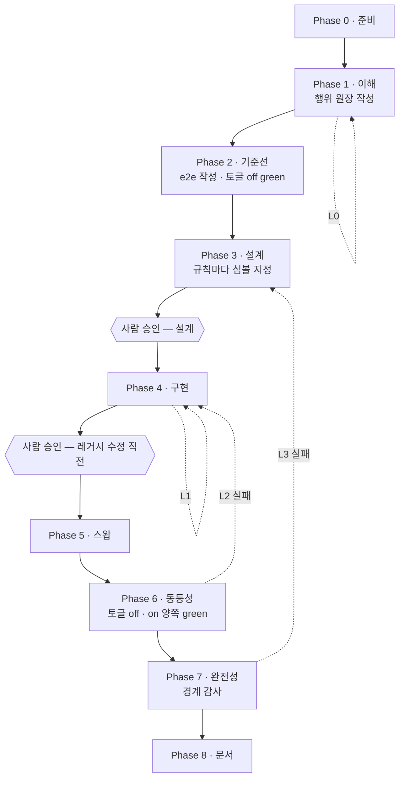

# 레거시 마이그레이션 OS 설계

- 상태: 초안 — 구조는 확정, 실행 검증 전
- 대상: 프론트엔드와 백엔드가 분리되지 않은 레거시 PHP 서비스의 백엔드를 Spring/Kotlin 으로
  슬라이스 단위 이관
- 구성 요소: 마이그레이션 스킬 6개, 서브에이전트 8개, 훅 2개
  (저장소에는 이 OS 와 무관한 범용 스킬도 있다)

이 문서는 살아있는 설계 문서다. 설계가 바뀌면 여기를 먼저 고치고 구현을 따라오게 한다.
결정마다 상태(합의 / 잠정 / 검토 중)와 근거를 남기는 이유는, 나중에 바꾸려는 사람이
"왜 이렇게 됐는지"를 몰라 같은 함정을 다시 밟는 걸 막기 위해서다.

## 1. 풀려는 문제

레거시 PHP 는 화면과 업무 로직이 한 파일에 섞여 있다. 이걸 한 번에 옮기는 대신,
백엔드에 해당하는 부분만 Spring 으로 떼어내고 PHP 가 그것을 호출하게 바꾼다. 화면은 그대로
두므로 기존 동작이 곧 정답지가 된다.

그런데 이 전환에는 확인해야 할 것이 **두 가지**인데 흔히 하나만 확인한다.

| 질문 | 답할 수 있는 것 |
|---|---|
| 이관 전후 동작이 같은가 | e2e 테스트 |
| 도메인 로직이 실제로 다 옮겨갔는가 | **e2e 로는 답할 수 없다** |

두 번째가 답이 안 되는 이유는 구조적이다. PHP 가 규칙을 여전히 계산하고 새 백엔드에는
데이터만 요청해도, 화면에 찍히는 결과는 완전히 이관된 경우와 동일하다. e2e 는 화면만
관찰하므로 둘을 구분하지 못한다. 슬라이스가 green 인 채로 절반만 이관된 상태가 나온다.

## 2. 핵심 설계 결정

| # | 결정 | 상태 | 근거 |
|---|---|---|---|
| D-01 | 검증 장치를 둘로 나눈다 — e2e(동등성) + 코드 재독 감사(완전성) | 합의 | 1장. 두 질문은 원리적으로 다른 관찰 수단을 요구한다 |
| D-02 | 두 장치를 **행위 원장** 한 표로 잇는다 | 합의 | 단계별 산출물이 따로 놀면 오케스트레이션이 불가능하다. 3장 |
| D-03 | 루프를 4개로 나누고 각각 다른 조건에서 닫는다 | 합의 | 4장. 루프 하나가 여러 실패 유형을 떠안으면 어디로 되돌아갈지 결정할 수 없다 |
| D-04 | 사람 게이트는 2개 — 설계 승인, 레거시 수정 직전 | 합의 | 되돌리기 비용이 급증하는 두 지점. 5장 |
| D-05 | 스킬에는 환경 상수를 두지 않고 gitignore 된 설정 파일에서 읽는다 | 합의 | 6장. 저장소는 공개, 대상 코드는 비공개 |
| D-06 | 레거시 전환은 데이터 접근 계층 내부에서만, 환경변수로 경로 전환 | 합의 | 버려질 연결 코드를 한 계층에 가둔다. 7장 |
| D-07 | 판단이 필요한 역할만 상위 모델, 패턴 추종 역할은 하위 모델 | 잠정 | 8장. 실제 토큰 소모를 보고 조정 |
| D-08 | 산출물(원장·설계서·감사)은 백엔드 저장소 docs 에 쓴다 | 잠정 | 코드와 같이 버전 관리되고 팀이 리뷰에서 본다. 다만 초안 상태가 히스토리에 남는다 |
| D-09 | 환경 기동·e2e 실행은 얇게만 갖고, 이미 있으면 위임한다 | 합의 | 마이그레이션 고유 로직만 이 저장소가 소유한다 |
| D-10 | 슬라이스 산출물은 번호 접두 파일명으로 고정한다 | 합의 | 게이트에서 세션이 끊기는 설계다. 진행 단계가 `ls` 로 관찰돼야 재개할 수 있다. 3장 |
| D-11 | 레드팀은 라운드마다 다른 렌즈로 읽는다 | 합의 | 같은 프롬프트를 두 번 돌린 빈손은 한 번보다 거의 강하지 않다. 4장 |
| D-12 | 원장의 열마다 쓰는 주체가 정확히 하나다 | 합의 | 3장. 소비자가 전제하는 열을 아무도 쓰지 않는 상태가 실제로 있었다 |
| D-13 | e2e 하네스를 이 디렉토리 안의 gitignore 된 레포로 둔다 | 합의 | 6장. 설정의 모든 경로가 프로젝트 안이 되어 `--add-dir` 이 사라진다 |

### 흐름 한눈에



담당은 왼쪽부터 analyst·redteam(1) → e2e author(2) → designer(3) → implementer(4) →
swap engineer(5) → 오케스트레이터(6) → auditor(7) → scribe(8) 이다.

## 3. 행위 원장

슬라이스가 강제하는 규칙을 전부 번호 붙여 나열한 표. 포맷은
`.claude/skills/legacy-slice/references/ledger-format.md` 가 정본이다.

```
| ID | 규칙 | 분류 | 출처 | 관찰 | 이관 | 비고 |
```

**열마다 쓰는 주체는 정확히 하나다(D-12).** 이게 규율이 아니라 계약인 이유는, 소비자가
전제하는 열을 아무도 쓰지 않으면 파이프라인이 조용히 끊기기 때문이다. 초안에서 실제로
`이관` 열이 그 상태였다 — 감사자는 채워져 있다고 전제하는데 구현자는 반환만 하고 있었다.

| 쓰는 쪽 | 열 | 시점 |
|---|---|---|
| analyst | 규칙 · 분류 · 출처 | Phase 1 |
| 오케스트레이터 | ID 배정 · 레드팀 델타 병합 | Phase 1 루프 |
| e2e author | 관찰 (assertion 또는 `불가`) | Phase 2 |
| implementer | 이관 (심볼 인용) | Phase 4 |
| auditor | 없음 — 읽고 판정만 한다 | Phase 7 |

ID 는 오케스트레이터만 배정한다. 레드팀은 `제안 ID` 로 내고, 병합할 때 현재 최대값 다음
번호를 새로 준다. ID 는 append-only 다 — 감사에서 발견된 규칙이 Phase 1 로 되돌아와도
기존 번호를 재사용하지 않는다. e2e·설계·구현이 이미 그 번호를 인용하고 있기 때문이다.

| 읽는 쪽 | 쓰임 |
|---|---|
| designer | 도메인 행마다 새 백엔드의 어느 심볼에 살지 결정 |
| auditor | 행마다 이관 여부 판정 |
| scribe | 행을 기획자·운영자용 문장으로 |

### 슬라이스 산출물

한 슬라이스의 산출물은 `<docs.root>/<docs.slicesDir>/<slice-id>/` 아래에 번호 순으로 쌓인다.

| 파일 | 쓰는 쪽 | Phase |
|---|---|---|
| `00-ledger.md` | analyst → 오케스트레이터 → e2e author → implementer | 1 · 2 · 4 |
| `01-design.md` | designer | 3 |
| `02-swap.md` | swap engineer | 5 |
| `03-audit.md` | auditor | 7 |
| `04-domain-doc.md` | scribe | 8 |

번호는 정렬 때문이 아니다. 이 흐름은 게이트에서 사람을 기다리므로 세션이 반드시 끊기는데,
어디까지 갔는지 적어두는 곳이 따로 없었다. 존재하는 파일의 최대 번호가 곧 끝난 Phase 라서
`ls` 한 번이 재개 지점이 된다. `status.sh` 가 이걸 읽어 슬라이스마다 출력한다.

### 분류 기준

`도메인` / `화면` / `경계` 셋 중 하나. 판정 질문은 하나다.

> 전혀 다른 클라이언트(모바일 앱, 배치, 파트너 API)가 같은 데이터를 다룬다면
> 이 규칙을 똑같이 지켜야 하는가?

그렇다면 도메인이다. 페이지 스크립트 안에 있든 SQL 의 WHERE 절 안에 있든 상관없다.
어려운 경우를 가르는 두 규칙 — *값은 화면, 규칙은 백엔드* 와 *경계는 백엔드가 진실일 때만
경계다* — 이 둘이 실무 판정의 대부분을 결정한다.

**판정 루브릭의 정본은 `ledger-format.md` 다.** 여기서는 왜 세 분류인지만 말하고, 어떻게
판정하는지는 거기에 둔다. 분석가 에이전트만 사본을 인라인으로 갖는데, 그건 분석가가 이
루브릭을 모든 행에 적용하기 때문이다 — **매 행마다 적용하는 것은 인라인, 가끔 참조하는
것은 reference** 가 이 저장소의 기준이다. 서브에이전트에게 참조 파일은 툴 콜 하나 거리라
건너뛸 수 있고, 인라인 텍스트는 반드시 컨텍스트에 들어간다. 사본을 고칠 일이 생기면
정본을 먼저 고친다.

### 관찰 불가를 인정한다

e2e 로 관찰할 수 없는 규칙이 있다. 검색어의 와일드카드 문자 처리처럼 화면에서 정상 동작과
구분되지 않는 것들이다. 이걸 억지로 약한 assertion 으로 덮으면 거짓 확신만 생긴다.
`불가:<이유>` 로 정직하게 적고, 감사가 "백엔드 단위 테스트가 있는가"를 대신 확인한다.
둘 다 없으면 `무방비` 판정이다.

## 4. 루프

| 루프 | 위치 | 닫히는 조건 | 상한 | 넘으면 |
|---|---|---|---|---|
| L0 이해 | Phase 1 | 레드팀이 새 규칙을 못 찾음 (2회 연속) | 3 | 사람 판단 |
| L1 구현 | Phase 4 | 빌드·단위·아키텍처 테스트 green | 5 | 설계 결함 의심 |
| L2 동등성 | Phase 6 | 토글 off/on 양쪽 green | 5 | 사람 판단 |
| L3 완전성 | Phase 7 | 감사 PASS | 3 | 사람 판단 |

L0 에 가장 많은 예산을 쓴다. 놓친 규칙 하나를 L0 에서 잡으면 재독 한 번으로 끝나지만,
L3 에서 잡히면 설계부터 다시 밟는다. 같은 결함의 비용이 단계마다 몇 배씩 뛴다.

L0 의 정지 조건이 "1회"가 아니라 "2회 연속"인 이유: 한 번 빈손인 것은 레드팀이 분석가와
같은 곳을 봤다는 뜻일 수 있다. 두 번째 빈 라운드가 있어야 "없다"가 정보가 된다.

그런데 같은 프롬프트로 두 번 돌리면 두 번째도 같은 곳을 본다. 새 서브에이전트는 앞 라운드의
기억이 없으므로 같은 분포에서 다시 뽑는 것이고, 그러면 두 번의 빈손은 한 번보다 거의 강하지
않다. 그래서 레드팀에 **라운드마다 다른 렌즈를 준다(D-11)**.

| 라운드 | 렌즈 |
|---|---|
| 1 | 페이지 스크립트 · 쿼리 구성 · 조용한 기본값 |
| 2 | 템플릿 · 환경 분기 · 포함된 commons |
| 3 | 부재 — 없는 트랜잭션, 없는 검증, 없는 인가 |

서로 다른 각도가 전부 빈손인 것은 같은 각도가 두 번 빈손인 것보다 훨씬 강한 증거다.
상한 3 회도 이때 비로소 근거를 갖는다 — 렌즈가 셋이라 셋이다.

L2 는 실패할 때마다 토글 off 패스도 다시 돌린다. 살아있는 DB 위에서 돌기 때문에 기준선
자체가 흔들릴 수 있고, 그 경우 원인은 이관이 아니라 테스트에 있다.

## 5. 게이트

| 게이트 | 위치 | 왜 여기인가 |
|---|---|---|
| 설계 승인 | Phase 3 이후 | 이후 단계가 전부 이 설계 위에 쌓인다. 틀리면 구현·스왑·검증이 모두 헛일 |
| 레거시 수정 직전 | Phase 5 이전 | 살아있는 운영 코드를 처음 건드리는 지점 |

그 사이와 이후는 자율로 둔다. 게이트를 늘리면 안전해 보이지만, 사람이 매 단계 확인해야
하는 시스템은 결국 안 돌린다.

**재진입도 게이트를 다시 지난다.** 감사(Phase 7)가 설계 결함을 찾아 Phase 3 으로 되돌리면
바뀐 설계는 다시 승인을 받는다. 그러지 않으면 사람이 본 적 없는 설계가 게이트를 우회해
구현으로 흘러간다. 구현만 고치는 재진입(Phase 4)에는 게이트가 없다 — 설계는 그대로이므로
승인의 대상이 바뀌지 않았다.

## 6. 환경 바인딩과 공개 원칙

이 저장소는 공개고, 대상 코드는 비공개다. 그래서 스킬과 에이전트에는 경로·호스트명·포트·
테이블명을 한 글자도 두지 않는다. 전부 `.claude/config/workspace.json` 에서 읽는다.

| 파일 | 추적 | 내용 |
|---|---|---|
| `workspace.example.json` | 추적됨 | 자리표시자만 있는 골격 |
| `workspace.json` | gitignore | 실제 경로·호스트·포트 |
| `redaction.example.json` | 추적됨 | 패턴 골격 |
| `redaction.json` | gitignore | 유출 감지 패턴. 패턴 자체가 내부 시스템명이라 이것도 비공개 |

### e2e 하네스의 위치 (D-13)

동등성 오라클이 쓰는 Playwright 하네스는 `cs-e2e/` 에 있다. `php_legacy/`·`cs-system/` 과
같은 층위의 gitignore 된 체크아웃이고, 다른 점은 이게 **이 OS 가 소유한 레포**라는 것이다.

기존에 쓰던 공용 e2e 레포를 참조하지 않고 전용으로 새로 둔 이유는 두 가지다.

- 공용 레포는 여러 서비스가 함께 쓴다. 그 중 하나가 자기 소비자 디렉토리 안으로 들어가면
  소유 관계가 뒤집히고, 다른 참조가 전부 깨진다.
- 밖에 두면 `--add-dir` 이 필요해진다. 안에 두면 설정의 모든 경로가 프로젝트 안이 되고,
  그 결과 **`run-e2e-test` 같은 스킬을 상수 없이 이 저장소에 추적 파일로 둘 수 있다.**
  D-05 가 원한 상태가 그때 비로소 완성된다.

하네스가 강제하는 구조 — 인터페이스(무엇을) / 스택별 구현체(어떻게) / 공유 spec — 는
`cs-e2e/` 안의 README 들이 정본이다. spec 은 원장에서 나오고, 그 규약은 e2e author 가 읽는다.

기본 base URL 은 **로컬**이다. 동등성 루프가 토글을 뒤집어 가며 같은 spec 을 두 번 돌려야
하는데, 공유 dev 서버를 대상으로 하면 회차마다 배포가 끼어들고 남의 작업도 위험해진다.

훅 두 개가 경계를 강제한다.

- `guard-company-content.py` — git 명령 앞에서 스테이징된 경로와 **추가된 diff 줄**을 검사해,
  회사 경로나 redaction 패턴이 걸리면 커밋을 막는다. 삭제 줄은 검사하지 않는다(유출된
  문자열을 지우는 커밋까지 막으면 안 되므로).
- `php-encoding-guard.py` — 레거시 파일을 편집하기 전에 인코딩을 기록하고, 편집 후 바뀌었거나
  깨졌으면 막는다. 대상 트리는 파일마다 인코딩이 다르고, 깨진 인코딩은 파이프라인의 어떤
  테스트로도 관찰되지 않는다. 사람이 화면을 봐야만 안다.

## 7. 레거시 전환 방식

데이터 접근 계층의 메서드 내부만 바꾼다. 화면과 템플릿은 건드리지 않는다.

1. 원본 메서드를 `legacy` 접두 이름으로 **바꾸기만** 한다. 본문은 한 글자도 손대지 않는다.
2. 원래 이름으로 새 메서드를 만들고, 본문은 스위치 하나로 둔다.
3. 스위치는 환경변수만 읽는다. 값이 없거나 모르는 값이면 기존 경로로 간다.
4. 새 백엔드 호출 코드는 의도적으로 단순하게 둔다. 어차피 화면을 새로 만드는 날 통째로
   버려질 코드다. 정교하게 만들면 나중에 지울 범위만 흐려진다.

반환 형태는 원본과 정확히 같아야 한다. 호출부가 그대로이므로 비슷하기만 한 값은 조용히
잘못 렌더링된다.

### 운영에는 어떻게 도달하는가

이 OS 의 루프는 전부 로컬에서 돈다. 토글 환경변수는 로컬 compose env 파일에 쓰이므로
**운영에는 그 변수가 아예 없고, 스위치는 값이 없으면 기존 경로로 간다(위 3번).** 따라서
스왑이 머지돼도 운영 동작은 바뀌지 않는다.

이걸 적어두는 이유는 게이트 2 의 문구가 "살아있는 운영 코드"라고 경고하기 때문이다. 맞는
경고지만 위험의 종류가 다르다. 위험한 건 토글이 켜지는 것이 아니라 **레거시 메서드를 잘못
건드리는 것**이다. 그래서 게이트 2 에서 사람이 봐야 할 것은 롤백 절차가 아니라 "원본 메서드가
이름만 바뀌고 내용은 한 글자도 안 바뀌었는가"다.

운영에서 실제로 새 경로를 켜는 일은 이 OS 의 범위 밖이다. 슬라이스가 끝난 뒤 팀이 따로
결정한다.

## 8. 모델 배정

| 역할 | 모델 | 이유 |
|---|---|---|
| analyst · redteam · designer · auditor | opus | 판단이 결과를 좌우한다 |
| e2e author · implementer · scribe | sonnet | 확립된 패턴을 따르는 작업 |
| swap engineer | opus | 작업은 좁지만 살아있는 코드라 실수 비용이 크다 |

잠정이다. 첫 슬라이스를 돌려 실제 소모를 보고 조정한다.

## 9. 열린 항목

| 항목 | 상태 |
|---|---|
| 9단계 흐름을 끝까지 돌려본 적이 없다 | 첫 슬라이스에서 검증 |
| 토글 환경변수가 실제로 PHP 프로세스에 도달하는지 | 서비스하는 컨테이너마다 전달 방식이 달라 실측 필요 |
| 렌즈 3개가 L0 를 마르게 하는 데 충분한지 | 3라운드에도 새 규칙이 나오면 렌즈를 늘린다 |
| 슬라이스 하나의 재독 비용 | opus 서브에이전트가 최소 6회, 루프 재시도까지 하면 20회를 넘고 매 호출이 레거시 트리를 처음부터 다시 읽는다. D-07 을 조정할 때 볼 숫자는 모델 등급보다 이쪽이다 |
| 산출물을 백엔드 저장소에 쓰는 것(D-08) | 초안이 히스토리에 남는 문제. 슬라이스 종료 시 한 번에 커밋하는 대안 검토 |
| 감사가 e2e 로 못 잡는 것을 정말 잡는지 | 첫 감사 결과로 판단 |

## 변경 이력

| 날짜 | 변경 |
|---|---|
| 2026-08-30 | 최초 작성. 구조 확정, 실행 검증 전 |
| 2026-08-30 | 설계 검토 반영 — 원장 열 소유권(D-12), 산출물 파일명(D-10), 레드팀 렌즈(D-11) 추가. 게이트 재진입과 운영 도달 경로를 명시하고, 분류 루브릭 정본을 `ledger-format.md` 로 일원화 |
