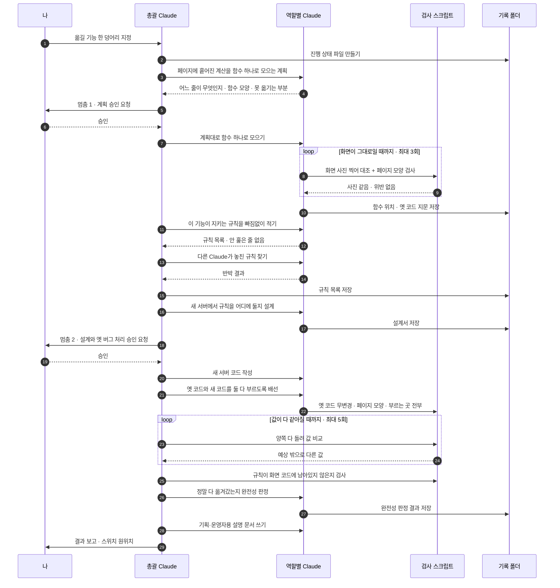
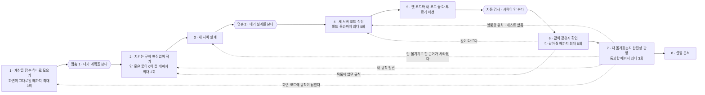
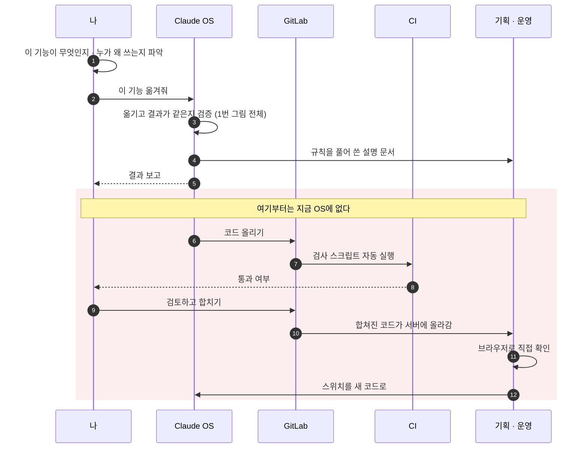

# 이 OS는 어떻게 도는가

> **2026-09-11 주의.** 아래 그림 셋은 **v2** 를 그린 것이고, 그날 OS 가 v3 로 축소되었다. 달라진 것 넷만 먼저 읽어라.
>
> 1. **한 번에 옮기는 덩어리가 페이지 하나로 줄었다.** "같은 데이터 접근 코드를 부르는 페이지 전부"가 아니다. 부르는 곳을 전부 찾는 일은 남아 있지만, 그것은 작업 목록이 아니라 **새 서버 API 를 설계할 때 알아야 하는 계약**이다.
> 2. **사람이 멈추는 곳이 셋이 되었다.** 앞에 **묻는 단계**가 생겼다 — 이 기능을 누가 왜 쓰는지, 발견한 동작이 의도인지 결함인지, 화면에 남아도 되는 규칙은 무엇인지. 코드를 읽어서는 나오지 않는 정보이므로 답이 비면 설계로 넘어가지 않는다. 세 곳 다 한 페이지 분량이라 실제로 읽힌다.
> 3. **기계가 할 일을 총괄 Claude 가 손으로 하지 않는다.** 스위치를 뒤집고 사진을 찍고 값을 비교하는 절차 전체가 `pagecheck` 한 명령이고, 회차와 상한은 파일이 든다. 상한에 닿으면 멈추고 사람에게 보고한다. 지난 회차에 이 루프가 상한 5 를 10 회까지 돈 것을 아무도 못 본 이유가 셈하는 곳이 없었기 때문이다.
> 4. **회차가 회차를 가르치는 장치가 생겼다.** 역할마다 학습 기록을 남기고, 다음 페이지에서 같은 역할이 그것을 읽는다. 다만 **근거를 인용하지 않은 깨달음은 학습 기록에 넣지 않는다** — AI 가 스스로 쓴 반성으로 지시문을 고치면 안 고친 것보다 나빠진다는 측정이 있다. 학습 기록에서 지시문 개정을 제안하는 것은 도구가 하고, 적용은 사람이 diff 로 승인한다.
>
> 그림을 v3 로 다시 그리는 것은 다음 회차의 일이다. 정확한 현재 설계는 `docs/legacy-migration-os.md` 1.6장이고, 왜 그렇게 바꿨는지는 `docs/reviews/2026-09-11-os-shape-review.md` 다.
>
> **`docs/cause-loop.md` 와의 관계.** 그 문서는 이 다시 그리기의 일부가 아니고 이 문서를 대체하지도 않는다. 여기 그린 전체 위에 얹힌 **더 작은 루프 하나** — 루프가 한 바퀴 더 돌 때 이유를 하나 받아 쌓는 원인 루프 — 만 다룬다.

이 문서는 그림 세 장으로 되어 있다. 첫 장은 **지금 실제로 도는 것**, 둘째 장은 **틀렸을 때 어디로 되돌아가는가**, 셋째 장은 **원하는 전체 흐름과 지금 비어 있는 자리**다.

용어는 전부 일상어로 썼다. 스킬 파일에 적힌 내부 용어와의 대응은 맨 아래 표에 있다.

---

## 1. 지금 실제로 도는 방식

한 덩어리를 옮기는 동안 누가 무엇을 하는지. 사람이 멈춰 서는 곳은 딱 두 군데다.

읽는 요령 셋.

**총괄 Claude는 레거시 코드를 직접 읽지 않는다.** 읽는 일은 전부 역할별 Claude가 하고, 총괄은 요약만 받는다. 총괄이 코드를 읽기 시작하면 그 세션의 비용이 총괄 자신에게 쏠린다.

**기록 폴더가 진행 상태의 정본이다.** 대화가 끊겨도 폴더 안 파일 번호의 최댓값을 보면 어디까지 갔는지 알 수 있다. 멈춤 지점에서 세션이 끊기는 것이 정상이라서 이렇게 만들었다.

**확인하는 쪽과 작업하는 쪽이 다르다.** 규칙 목록을 쓴 Claude와 그것을 반박하는 Claude가 다르고, 값 비교는 사람도 에이전트도 아닌 스크립트가 한다. 에이전트의 "다 했습니다"는 근거로 치지 않는다.

---

## 2. 틀렸을 때 되돌아가는 곳

앞의 그림은 한 번에 성공한 경우다. 실제로는 뒤에서 발견한 것이 앞 단계를 다시 열게 만든다.

7단계에서 되돌아가는 화살표가 유독 많은 이유가 이 설계의 전부다.

값이 같은지 확인하는 것으로는 **다 옮겨갔는지**를 알 수 없다. PHP가 여전히 계산하고 있고 새 서버에게는 아예 묻지 않는다면, 화면에 나오는 값은 당연히 똑같고 모든 검사가 초록불이다. 옮긴 것이 하나도 없는데 통과한다. 그래서 값 비교와 별개로 "규칙이 정말 새 서버로 갔는가"를 따로 묻고, 그것이 7단계다.

되돌아가면 그 아래 단계를 전부 다시 돈다. 그 비용 때문에 1단계와 2단계에 예산을 많이 준다. 2단계에서 잡히는 규칙 하나는 다시 읽기 한 번이지만, 7단계에서 잡히면 설계부터 다시다.

---

## 3. 원하는 전체 흐름과 비어 있는 자리

붉은 점선 구간이 지금 OS에 없는 부분이다.

### 비어 있는 자리 넷

**하나. 내가 기능을 이해하는 단계가 없다.** OS는 옮길 후보의 순위를 매겨 주지만, "이 기능을 누가 왜 쓰는가"는 코드에 적혀 있지 않다. 코드를 아무리 잘 읽어도 나오지 않는 정보이므로 이 자리는 자동화 대상이 아니라 **사람을 만나 물어보는 절차**로 채워야 한다.

**둘. 코드를 올리는 단계가 없다.** 지금은 옮긴 코드가 내 컴퓨터에만 있다. 병합 요청을 만드는 별도 스킬이 개인 설정에 있지만 이 OS와 이어져 있지 않다.

**셋. CI가 절반 생겼다.** 이 저장소에 CI 가 붙었다 — push 와 PR 마다 OS 자신의 셀프테스트가 돌고, 실행된 검사 수에 바닥이 있어서 검사가 조용히 건너뛰기로 바뀌면 빨강이 된다. 그래서 **OS 의 도구·훅·교차 검사가 통과했다는 사실은 이제 나 말고도 확인할 수 있다.**

**그대로인 쪽이 더 크다.** 그 CI 가 재는 것은 **OS 자신이지 이관 결과가 아니다.** 화면 사진 대조·양쪽 다 돌려 비교·완전성 판정은 회사 코드와 로컬 스택이 있어야 돌아가므로 이 공개 저장소의 CI 가 돌릴 수 없고, 여전히 전부 내 컴퓨터에서 총괄 Claude가 돌린다. 리뷰어 입장에서 "이 기능의 이관을 검증했다"는 말과 검증 자체를 구별할 방법은 아직 없다. **위 그림의 붉은 구간에 있는 CI 는 올린 코드를 검사하는 그 CI 이고, 그 자리는 그대로 비어 있다.** 비어 있는 넷 중에서 이것이 가장 크다는 판단도 그대로다.

**넷. 기획·운영이 확인하는 단계가 없다.** 설명 문서는 나가지만, 그 사람들이 브라우저로 확인하고 스위치를 새 코드로 넘기는 절차가 없다. 스위치를 넘기는 판단은 지금 나 혼자 한다.

### 채울 때 먼저 정해야 할 것

병합 요청이 생기면 **진행 상태를 적는 곳이 둘이 된다.** 지금은 기록 폴더가 정본이고 파일 번호로 진행 단계를 읽는다. 여기에 병합 요청이 더해지면 어느 쪽이 정본인지 정해야 한다.

셋 중 하나를 고르는 문제다. (1) 기록 폴더가 정본이고 병합 요청은 그 사본을 붙인다. (2) 병합 요청이 정본이고 기록 폴더는 근거 자료다. (3) 기록 폴더를 병합 요청에 함께 올려서 하나로 만든다. 정하지 않고 둘 다 쓰면 둘이 갈라지고, 갈라진 뒤에는 어느 쪽이 맞는지 아무도 모른다.

---

## 용어 대응표

스킬 파일에 적힌 말과 위 그림의 말을 잇는 표다. 왼쪽 열은 `.claude/` 아래 파일에서 볼 수 있는 표현이다.

| 스킬에 적힌 말 | 쉬운 말 | 정확히 무엇인가 |
|---|---|---|
| 페이지 | 한 번에 옮기는 기능 한 덩어리 | 같은 데이터 접근 코드를 부르는 페이지 **전부**. 페이지 하나가 아니다 |
| 교체 지점 | 갈아끼우는 자리 | 페이지 여기저기 흩어져 있던 계산을 PHP 함수 하나로 모아둔 것. 옛 코드와 새 코드를 그 함수 안에서만 바꿔 끼운다 |
| 규칙 목록 | 규칙 목록 | 이 기능이 지키는 규칙을 번호 붙여 전부 적은 표. 규칙마다 출처·확인 방법·이관 여부를 적는다 |
| 검증 | 확인 방법 | "이게 맞다"를 무엇으로 판정하는가 |
| 동등성 | 결과가 같은가 | 옮기기 전후로 화면에 나오는 값이 같은지 |
| 완전성 | 빠짐없이 옮겼는가 | 규칙이 정말 새 서버로 갔는지, 화면 코드에 남아 있지 않은지 |
| 이중 실행 | 양쪽 다 돌려 비교 | 한 요청에서 옛 코드와 새 코드를 둘 다 실행해 값을 비교하고, 화면에는 언제나 옛 값을 보여준다 |
| 기준 캡처 | 화면 사진 대조 | 바꾸기 전에 페이지 HTML을 찍어두고, 바꾼 뒤 찍은 것과 글자 단위로 비교 |
| 규칙 재검 | 놓친 규칙 찾기 | 규칙 목록을 쓴 Claude와 **다른** Claude가 같은 코드를 다시 읽고 반박 |
| 커버리지 | 안 훑은 줄이 없는지 | 함수 본문의 모든 줄이 어떤 규칙에 속하는지 확인 |
| 구조 린트 | 페이지 모양 검사 | 페이지에 계산이 다시 끼어들지 않았는지 기계가 검사 |
| 본문 해시 고정 | 옛 코드 지문 | 옮긴 옛 코드가 한 글자도 안 바뀌었는지 지문으로 대조 |
| 호출자 전수 | 부르는 곳 전부 찾기 | 그 기능을 부르는 자리가 정해진 곳 말고 또 있는지 |
| 관찰 목록 | 확인할 화면 목록 | 사진을 찍을 주소와 조건의 목록 |
| 교정표 | 옛 버그를 고칠지 정한 표 | 레거시의 잘못된 동작마다 "고친다 / 그대로 둔다"와 그 이유 |
| 토글 | 스위치 | 옛 코드로 갈지, 양쪽 다 돌릴지, 새 코드로 갈지 |
| 승인 지점 | 멈추는 지점 | 진행이 여기서 멈춘다. 사람이 보는 곳 둘, 기계가 막는 곳 둘 |
| 잔류합의 | 안 옮기기로 한 합의 | 규칙을 PHP에 남기기로 사람이 승인한 것. 누가 언제 승인했는지 적는다 |
| 무방비 | 확인할 방법이 없다 | 값 비교로도 사진 대조로도 안 보이는 규칙인데 테스트도 없는 상태 |
| depth | 얼마나 꼼꼼히 볼지 | shallow / normal / deep. 반박 횟수와 확인할 화면 수가 달라진다 |
