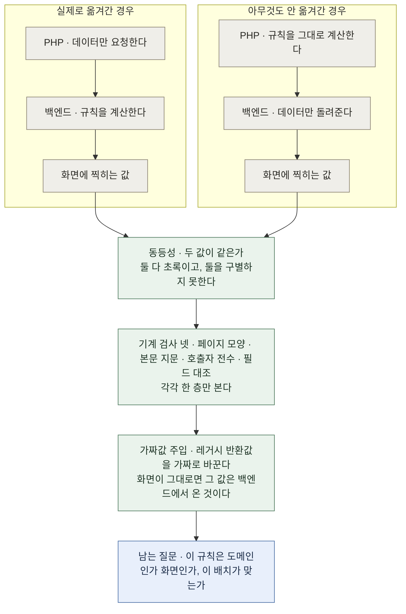
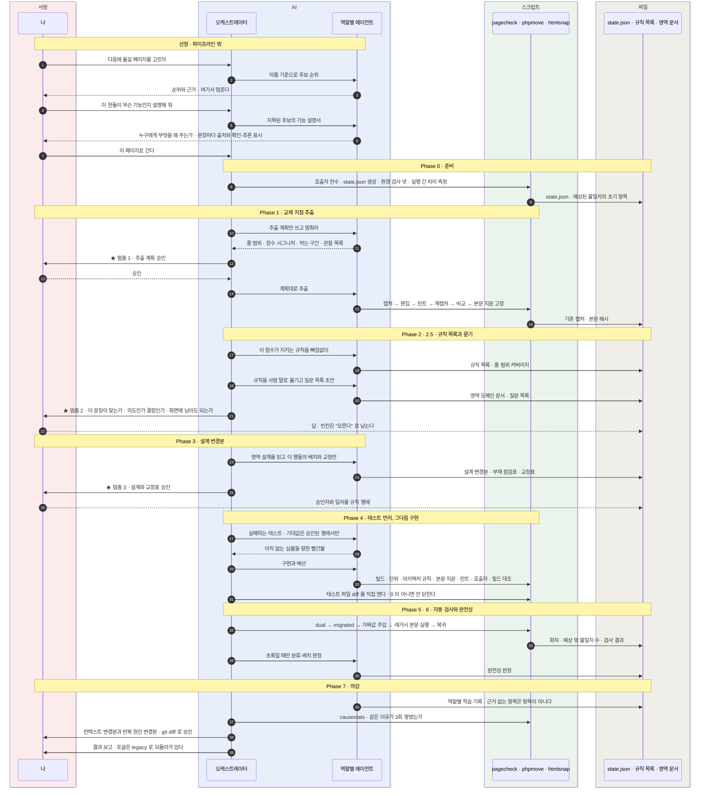
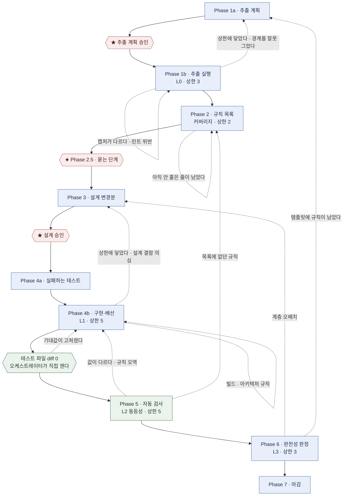

# 이 OS 는 어떻게 도는가

레거시 PHP 는 화면과 업무 로직이 한 파일에 섞여 있다. 이 OS 는 그중 **백엔드에 해당하는 부분만** Spring/Kotlin 으로 떼어내고 PHP 가 그것을 부르게 바꾼다. 화면은 그대로 두므로 **지금 동작이 곧 정답지**다.

**작업 단위는 교체 지점 함수 하나이고, 그것이 페이지 하나다.** 페이지마다 PHP 서비스 함수를 하나 만들어 흩어진 계산을 그 안에 모으고, 옛 코드와 새 백엔드를 그 함수 **안에서만** 갈아끼운다. 같은 함수를 부르는 다른 곳이 있어도 이번에 옮기는 것은 이 페이지 하나이고, 나머지 호출자는 레거시 본문을 그대로 돈다. 호출자를 전부 찾는 일은 여전히 필수인데, 그것은 **작업 목록이 아니라 영역 API 를 설계할 때 알아야 하는 계약**이다.

이 문서는 그림 넷으로 되어 있고, 그림 하나가 답하는 질문은 하나다.

| 그림 | 답하는 질문 |
|---|---|
| 1 | 값이 같다는 확인만으로 왜 부족한가 |
| 2 | 한 페이지를 옮기는 동안 사람과 AI 와 스크립트가 각각 무엇을 하는가 |
| 3 | 틀렸을 때 어디로 되돌아가는가 |
| 4 | 옮긴 코드가 사람들에게 닿기까지 어디가 비어 있는가 |

그림의 색은 역할이다 — 붉은색은 사람, 파란색은 AI, 초록색은 스크립트, 회색은 파일.

설계의 정본은 `docs/legacy-migration-os.md` 다. 이 문서와 정본이 어긋나면 **정본이 맞다.** 여기서 다루지 않는 것 하나는 루프 위에 얹힌 원인 루프의 어휘와 지표이고, 그것은 `docs/cause-loop.md` 가 진다. 왜 지금 모양이 되었는지는 `docs/reviews/2026-09-11-os-shape-review.md` 다.

---

## 1. 왜 검사가 둘인가

이 전환에서 확인해야 할 것은 둘인데, 흔히 하나만 확인한다.

| 질문 | 무엇이 답하나 |
|---|---|
| 이관 전후 결과가 같은가 | **동등성** — 교체 지점 안의 이중 실행 |
| 도메인 로직이 실제로 다 옮겨갔는가 | **동등성으로는 답할 수 없다** |

두 번째가 답이 안 되는 이유는 취향이 아니라 구조다. PHP 가 규칙을 여전히 계산하고 새 백엔드에는 데이터만 요청해도, 화면에 찍히는 값은 완전히 이관된 경우와 **똑같다.** 옮긴 것이 하나도 없는데 모든 검사가 초록이다. 그리고 이 논증은 검사를 바꿔도 살아남는다 — 화면이 아니라 값을 비교해도 **그 값이 어디서 계산됐는지는 여전히 안 보인다.**

그래서 완전성을 따로 묻고, 그 질문에는 **기계가 먼저 답한다** — 페이지 모양 검사(구조 린트), 옮긴 레거시 본문의 지문 대조(본문 해시), 교체 지점 밖에서 부르는 곳 찾기(호출자 전수), 백엔드가 노출한 필드와 어댑터가 실제로 요청한 필드 맞춰보기(필드 대조). 판정하는 AI 에게 남는 것은 **분류와 배치의 판단**뿐이다. 기계가 답할 수 있는 질문을 에이전트에게 시키지 않는다는 규율이 여기에 있다.

그런데 정적 검사는 **각각 한 층만 본다.** 층이 하나 생기면 사각지대가 하나 생긴다 — v1 은 규칙이 교체 지점 **위**에 있어서 실패했고, v2 는 규칙이 백엔드에 있는데 **어댑터가 그 필드를 요청하지 않아서** 실패했다. 그래서 층에 무관한 검사를 하나 더 둔다.

**가짜값 주입이 층에 무관한 이유**는 그것이 코드를 읽지 않고 결과를 바꿔 보기 때문이다. `migrated` 모드에서 래퍼의 레거시 반환값을 가짜값으로 바꿨는데도 화면이 그대로면, 화면이 쓰는 값은 레거시가 아니라 백엔드에서 온 것이다. 래퍼만 건드리므로 본문 지문은 그대로 유지된다.

**새 검사는 믿기 전에 고의로 깨뜨려 본다.** 어댑터가 필드를 요청하지 않도록 한 줄을 빼고 빨간불이 켜지는지 확인한 뒤 되돌린다. 빨간불을 본 적 없는 초록은 초록이 아니다.

---

## 2. 한 페이지가 도는 동안 누가 무엇을 하는가

일하는 쪽은 셋이다. **사람**, **AI**(오케스트레이터 하나와 역할별 서브에이전트 열), **스크립트**(도구 열넷과 훅 다섯). 그리고 그 셋이 주고받는 것은 대화가 아니라 **파일**이다.

### 사람이 멈추는 곳 — 파이프라인 안에 셋, 그 앞에 하나 더

| 멈추는 곳 | 어디 | 사람이 보는 것 | 종류 |
|---|---|---|---|
| 기능 설명서를 읽고 고른다 | 선정 — **파이프라인 밖 · 아래 셋에 들지 않는다** | 지목한 한둘의 기능 설명서 | 시작할지 정하는 자리 |
| **멈춤 1 · 추출 계획 승인** | Phase 1, 편집 **전** | 편집 계획의 줄 범위 · 함수 시그니처 · 막는 구간과 그 처리 · 관찰 목록 · 정규화 규칙 · 호출자 전수 | 승인 |
| **멈춤 2 · 묻는 단계** | Phase 2.5, 규칙 목록 **뒤** · 설계 **앞** | 규칙을 사람 말로 옮긴 문장 · 질문 목록 | 답하는 자리 |
| **멈춤 3 · 설계 승인** | Phase 3 뒤 | 자원 모양과 그것이 화면 모양이 아닌 이유 · 규칙 배치 · 교정표 전부 · 일부러 보존하는 결함 · 되받아칠 결정 | 승인 |

파이프라인 안의 셋 중 **승인은 둘이고 하나는 답하는 자리**다. 맨 윗줄이 그 셈에서 빠지는 이유는 하는 일이 다르기 때문이다 — 나머지 셋은 **이미 시작된 진행을 멈추는** 자리이고, 그것은 **시작할지 정하는** 자리다. 셋 다 한 페이지 분량이라 **실제로 읽힌다** — 지난 회차에 승인 지점 둘을 위임해 사람 대기가 0 이 되었는데도 회차가 12시간이었다는 사실이, 승인 지점은 병목이 아니었음을 말한다. 87행짜리 규칙 목록을 사람이 읽을 수 없었다는 사실이 위임의 진짜 비용을 말한다.

**고르기 전에 설명하는 단계가 왜 생겼나.** 선정 기준 아홉은 전부 비용과 위험을 묻는다 — 데이터를 우리가 소유하는지, 외부 의존이 몇인지, 읽기 위주인지, 템플릿이 얼마나 빽빽한지. 어느 것도 "이것이 무엇이고 누구에게 무엇을 해 주는가"를 묻지 않는다. 그래서 순위를 다 읽고도 고를 수 없었다(2026-09-14 관찰). 지금은 순위를 낸 뒤 멈추고, **사람이 지목한 한둘에만** 설명서를 만든다. 그 설명서는 **어디에도 보관하지 않는다** — 설명 담당의 최종 응답이 곧 설명서이고, 사람이 읽고 고르면 거기서 끝난다. 보관하면 도메인 문서 안에 규칙 행이 받치지 않는 절이 생기고, 그것을 지우는 의무와 지웠는지 재는 숫자가 따라온다.

**묻는 단계는 왜 Phase 2.5 인가.** 처음에는 Phase 0.5, 곧 추출보다도 앞에 있었다. 그 자리는 파이프라인 전체에서 **OS 가 그 기능을 가장 적게 아는 시점**이었고, 사람은 세 질문 어느 것에도 답하지 못했다. 규칙 목록이 나온 뒤라야 무엇을 묻는지가 구체적이다. 질문의 형태도 바뀌었다 — "의도가 무엇입니까"라고 **기억을 묻지 않고**, 규칙 행을 가리키며 "이 동작이 관찰되었는데 의도입니까 결함입니까"라고 **확인을 묻는다.** 답이 비면 설계로 넘어가지 않는다. 막지 않으면 추측이 들어가고, **추측은 규칙 목록에 사실처럼 적힌다.**

### 읽는 요령 넷

**오케스트레이터는 레거시 코드를 직접 읽지 않고, 산출물도 통째로 읽지 않는다.** 읽는 일은 전부 역할별 에이전트가 하고, 오케스트레이터는 각 산출물의 `## 요약` 20줄만 본다. 규율이 아니라 비용이다 — 첫 실행의 최대 지출처가 오케스트레이터 자신이었고, 그 비용은 모델 등급도 출력 길이도 아니라 **턴 수 × 턴당 컨텍스트**였다. 산출물을 통째로 읽는 오케스트레이터는 그 곱의 양쪽을 동시에 키운다.

**작업하는 쪽과 재는 쪽이 다르다.** 실패하는 테스트를 쓰는 에이전트와 그것을 통과시키는 에이전트가 다르고, 구현하는 에이전트와 배치를 판정하는 에이전트가 다르다. 초록 빌드에는 원인이 둘 있다 — 코드가 맞아진 것과 **기대값이 낮아진 것**. 둘을 가르는 것은 판단이 아니라 diff 이므로, 오케스트레이터가 테스트 파일의 `git diff --stat` 을 **자기 손으로** 잰다. 에이전트의 "다 했습니다"는 근거로 치지 않는다.

**기계가 답할 수 있는 질문은 에이전트에게 묻지 않는다.** 지문·린트·호출자·필드는 `phpmove`, 화면이 같은지는 `htmlsnap`, 검사 절차 전체는 `pagecheck` 가 답한다. 에이전트에게 남는 것은 분류와 배치와 판단이다.

**진행 상태의 정본은 `state.json` 하나다.** 승인 지점에서 세션이 끊기는 것이 정상인 설계라서, 어디까지 갔는지를 대화가 아니라 파일이 든다. 스킬이 로드될 때마다 상태 블록이 페이지마다 `pagecheck --show` 를 불러 phase·루프 회차·상한·토글을 화면에 찍는다. 산출물 파일명의 번호는 읽는 순서를 위해 남아 있을 뿐 **Phase 를 판정하지 않는다** — 파일명으로 추정한 Phase 와 기록된 Phase 가 한 화면에서 실제로 갈라진 적이 있다. `pagecheck --init` 은 이미 있는 기록을 덮어쓰지 않고 거부한다. 다시 만든 `state.json` 은 상한을 넘긴 루프를 1회차로 되살리기 때문이다.

---

## 3. 틀렸을 때 어디로 되돌아가는가

앞의 그림은 한 번에 성공한 경우다. 실제로는 뒤에서 발견한 것이 앞 단계를 다시 연다.

### 루프 다섯

| 루프 | 어디 | 닫히는 조건 | 상한 | 회차를 올리는 쪽 |
|---|---|---|---|---|
| L0 추출 | Phase 1 | 기준 캡처 비교가 전부 identical **그리고** 구조 린트 위반 0 | 3 | 오케스트레이터가 부른다 |
| 커버리지 | Phase 2 | 함수 본문의 모든 문장 범위에 규칙 ID 가 붙음 | 2 | 오케스트레이터가 부른다 |
| L1 구현 | Phase 4b | 빌드·아키텍처 규칙 초록 **그리고 Phase 4a 가 쓴 테스트가 수정 없이 통과** | 5 | 오케스트레이터가 부른다 |
| L2 동등성 | Phase 5 | 이중 실행 보고의 **예상 밖** 불일치 0 | 5 | `pagecheck` 가 스스로 올린다 |
| L3 완전성 | Phase 6 | 기계 검사가 전부 통과 **그리고** 판정이 PASS | 3 | `pagecheck` 가 스스로 올린다 |

**닫히는 조건이 전부 셀 수 있는 값이다.** 예전에는 규칙 목록이 "반박하는 AI 가 새 규칙을 더 못 찾음"으로 닫혔는데, 그것은 답할 수 없는 질문이었다 — 못 찾은 것이 없어서인지 안 본 곳이 있어서인지 그 자리에서 갈리지 않는다. 지금 묻는 것은 **"이 함수 본문에서 아직 아무 규칙도 붙지 않은 줄이 있는가"** 이고, 후자는 세어진다. 반박 라운드(규칙 재검)는 종료 조건에서 **수단**으로 내려갔고, v3 에서 **기본값이 0 라운드**다 — 뒤 단계가 목록에 없는 규칙을 증거와 함께 들고 오면 그때 한 라운드를 켠다.

**상한은 산문의 숫자가 아니라 `state.json` 의 값이다.** 상한에 닿으면 토글도 캡처도 건드리지 않고 멈춘 뒤 사람에게 보고한다. **이것은 승인 지점과 다른 장치이고 위임되지 않는다** — 사람 승인 지점을 위임받은 회차에도 상한 보고는 위임되지 않는다. 지난 회차에 L2 가 상한 5 를 **10 회**까지 돈 것을 아무도 못 본 이유는 셈하는 곳이 없었기 때문이다.

**다만 위의 셋(L0·커버리지·L1)은 오케스트레이터가 회차 올리기를 불러야 올라간다.** 스테이지가 도는 L2·L3 와 달리 기계가 강제하지 않고, **부르지 않았다는 사실을 잡는 검사는 아직 없다.** 그래서 그 셋의 상한은 "장식"에서 "부르면 참"으로 옮겨간 것이고, 그 차이를 여기 적어 둔다 — 문서가 구현을 앞서 가는 것과 문서가 거짓말을 하는 것은 다르다.

### Phase 6 만 Phase 1 까지 되돌린다

값이 같은지 확인하는 것으로는 **다 옮겨갔는지**를 알 수 없다(1장). 그래서 값 비교와 별개로 "규칙이 정말 백엔드로 갔는가"를 따로 묻고, 그것이 Phase 6 이다. 화살표의 개수보다 **길이**가 중요하다 — 앞쪽 루프는 대개 자기 자리에서 한 바퀴 더 돌지만, Phase 6 의 판정은 설계까지도, 추출 계획까지도 되돌린다. 되돌아가면 그 아래 단계를 전부 다시 돈다. 그 비용 때문에 **예산은 앞쪽에 쓴다** — 놓친 규칙 하나를 Phase 2 에서 잡으면 규칙 목록 한 줄이지만, Phase 6 에서 잡히면 설계부터 다시다.

**재진입에도 규칙이 있다.** 설계를 고쳐 Phase 3 을 다시 지나면 **설계 승인을 다시 지난다** — 그러지 않으면 사람이 본 적 없는 설계가 승인 지점을 우회해 구현으로 흘러간다. Phase 1 로 되돌아가는 재진입은 **계획이 바뀌는가**로 갈린다: 같은 파일·같은 함수 경계를 그대로 두고 편집만 고치는 것은 승인을 다시 지나지 않고, 함수 경계나 남길 가드가 바뀌면 다시 지난다. 구현만 고치는 재진입에는 승인 지점이 없다 — 승인의 대상이 바뀌지 않았다.

### 그 다섯 위에 루프가 하나 더 있다

다섯은 **페이지의 루프**다. 한 바퀴가 답하는 것은 이 페이지가 언제 닫히는가이고, 페이지가 끝나면 그 회차를 읽는 곳이 없다. 그 위에 **OS 의 루프** 하나를 둔다. **한 바퀴의 단위는 페이지 완주가 아니라, 다섯 중 하나가 한 바퀴 더 도는 순간이다.**

두 바퀴째로 들어갈 때 **닫힌 어휘에서 이유를 하나 받는다.** 이유가 없으면 회차가 올라가지 않고, 어휘 밖의 값과 문장 없는 `기타` 는 거부된다. 이유는 `state.json` 에 쌓이고, 집계 도구가 **같은 이유 3회**를 찾으면 고칠 것 하나에 대한 변경분이 나온다 — **상한 값 · 지시문 · 새 검사** 셋 중 하나이고, 사람이 `git diff` 로 승인한다. 셋으로 닫아 둔 이유는 그것이 OS 가 실제로 고칠 수 있는 것의 전부이기 때문이다: 예산을 바꾸거나, 읽는 문장을 바꾸거나, 기계가 대신 보게 하거나.

**단위를 거기로 내린 이유는 회차가 12시간이기 때문이다.** 학습 장치가 전부 페이지 완주(Phase 7)에 묶여 있어서, v3 설계 나흘째까지 그 장치는 **한 번도 돌지 않았다.** 반면 재시도는 흔하다 — 지난 회차에 한 루프가 열 바퀴를 돌았고, 그 열 바퀴는 학습 장치가 한 번도 돌지 않는 동안 일어난 일이다. **학습의 단위를 가장 자주 일어나는 사건에 맞춘다.**

어휘 두 층과 지표 셋, 그리고 측정 자체를 약하게 만드는 가장 싼 길들을 각각 막는 장치는 `docs/cause-loop.md` 에 있다.

---

## 4. 무엇이 아직 비어 있는가

```mermaid
flowchart LR
  classDef human  fill:#fbeceb,stroke:#a95f58,color:#3d1e1b
  classDef ai     fill:#e8effb,stroke:#4a6fa5,color:#1b2c47
  classDef script fill:#eaf3ec,stroke:#4f7a5e,color:#1e3325
  classDef gap    fill:#ffffff,stroke:#a95f58,stroke-dasharray:5 4,color:#6b3a34

  subgraph HAVE["있는 것 · 전부 내 컴퓨터에서 돈다"]
    S1["선정 · 사람이 설명서를 읽고 고른다"]:::human
    S2["Phase 0–7 · 옮기고, 동등성과 완전성을 각각 확인한다"]:::ai
    S3["영역 도메인 문서 · 기획·운영이 읽는다"]:::ai
    S1 --> S2 --> S3
  end

  subgraph MISSING["비어 있는 것"]
    E1["코드를 올린다 · 병합 요청"]:::gap
    E2["백엔드 저장소의 CI · 옮겨간 코드를 검사한다"]:::gap
    E3["사람이 검토하고 병합한다"]:::gap
    E4["기획·운영이 브라우저로 확인한다"]:::gap
    E5["토글을 새 코드로 넘긴다"]:::gap
    E1 --> E2 --> E3 --> E4 --> E5
  end

  S3 --> E1
```

### 파이프라인 밖 — 옮긴 코드가 사람들에게 닿는 길

**하나. 코드를 올리는 단계가 없다.** 지금은 옮긴 코드가 내 컴퓨터에만 있다. 병합 요청을 만드는 스킬이 개인 설정에 따로 있지만 이 OS 와 이어져 있지 않다. 이어 붙이기 전에 정해야 할 것이 하나 있다 — **진행 상태를 적는 곳이 둘이 된다.** 지금 정본은 `state.json` 하나다. 여기에 병합 요청이 더해지면 셋 중 하나를 골라야 한다: (1) `state.json` 이 정본이고 병합 요청은 그 사본을 붙인다 (2) 병합 요청이 정본이고 페이지 디렉터리는 근거 자료다 (3) 페이지 디렉터리를 병합 요청에 함께 올려 하나로 만든다. 정하지 않고 둘 다 쓰면 갈라지고, **갈라진 뒤에는 어느 쪽이 맞는지 아무도 모른다.**

**둘. CI 가 없다 — 그리고 그 자리를 채울 CI 는 이 저장소의 것이 아니다.** 이 저장소에도 CI 가 있었다. push 와 pull request 마다 **OS 자신의 셀프테스트**를 돌렸고, 붙인 날과 같은 날 걷어냈다(2026-09-15). 걷어낸 자리를 그냥 비워 두지 않고 왜 비는지 적는 이유는, **그 CI 가 돌고 있던 동안에도 비어 있던 자리는 그대로였기 때문이다.** OS 의 도구와 훅과 교차 검사가 초록이라는 사실은 **이 OS 가 동작한다**는 진술이고, **어떤 페이지의 이관이 검증됐다**는 진술과 아무 상관이 없다. 둘을 같은 초록으로 나란히 두면 리뷰어는 후자를 봤다고 믿게 된다.

그 자리를 채울 수 있는 곳은 **백엔드 저장소의 CI** 다. 옮겨간 코드는 거기 있고, 그것을 검사하는 일은 회사 환경이나 레거시 스택 없이도 그 저장소 안에서 할 수 있다. **이미 참인 것은 여기까지다** — 그 저장소에 CI 설정이 있으므로 **자리는 이미 있다.**

**아직 참이 아닌 것은 그다음이다.** 이 OS 가 만든 것들, 곧 Phase 4a 가 쓴 테스트와 설계가 따르는 아키텍처 규칙이 그 파이프라인에서 실제로 도는지는 확인되지 않았다. **이 OS 로 옮긴 페이지가 아직 하나도 올라간 적이 없어서 확인할 방법 자체가 없다.** 첫 페이지를 올려 봐야 안다.

그리고 그 자리가 채워져도 **절반만 답한다.** 이중 실행·가짜값 주입·기준 캡처는 레거시 스택과 데이터가 있어야 돌고, 지금 "이관이 검증됐다"를 실제로 지고 있는 것은 그 셋이다. **그 셋이 초록이라는 사실을 아는 사람은 그것을 돌린 나 하나다.** 리뷰어 입장에서 "검증했다"는 말과 검증 자체를 구별할 방법은 아직 없고, 비어 있는 것들 중 이것이 가장 크다.

걷어내면서 **잃은 것 하나도 적어 둔다.** 그 CI 에는 실제로 돌아간 검사 수의 바닥이 있어서, 셀프테스트의 검사가 조용히 건너뜀으로 바뀌면 빨강이 됐다. 지금 셀프테스트는 통과·실패·건너뜀을 세 숫자로 갈라 찍지만 그 숫자를 읽고 빨간불을 켜 주는 것은 없다 — **보이기는 하고 잡히지는 않는다.** 실패한 검사에는 이미 자기 빨간불이 있고, 이 바닥이 막던 것은 빨간불이 없는 다른 실패, 곧 조용히 돌지 않게 된 검사다.

**셋. 기획·운영이 확인하는 단계가 없다.** 영역 도메인 문서는 나가지만, 그 사람들이 브라우저로 확인하고 스위치를 새 코드로 넘기는 절차가 없다. 운영에서 새 경로를 켜는 일과 운영 트래픽에 이중 실행을 켜는 일은 **이 OS 의 범위 밖이고 팀이 따로 정한다.** 지금 그 판단은 나 혼자 한다. 그래서 **모든 회차는 토글을 `legacy` 로 되돌리고 끝난다** — 검토되지 않은 코드 경로를 켜 둔 채 세션을 끝내는 것은 오케스트레이터가 할 결정이 아니다. 토글은 값이 없거나 모르는 값이면 레거시로 가므로, 배선이 머지돼도 운영은 이중 실행을 하지 않는다.

**넷. 묻는 단계의 답을 실제로 누구에게 받는지가 채워지지 않았다.** 절반은 갚았다 — 세 질문 중 첫째는 선정 단계의 설명서가 대부분 코드에서 답하고, 나머지 둘은 규칙 행을 가리키는 확인형 질문이 되었다. 그래도 **진짜 의도를 아는 사람이 따로 있다는 사실 자체는 그대로**이고, 그 사람이 누구인지는 영역마다 다르다. 첫 페이지에서 그 자리를 실제로 채워 보는 것이 이 항목을 닫는 방법이다.

### 파이프라인 안 — 아직 재어 보지 않은 것

| 빈자리 | 왜 비어 있는가 |
|---|---|
| **v3 를 한 페이지로 끝까지 돌려본 적이 없다** | 2026-09-11 에 설계되고 그 뒤로 장치가 더해졌다. 첫 회차가 v3 의 **유일한 정당화 수단**이다. 같은 영역의 두 번째 페이지까지 돌려야 "영역 단위 문서가 실제로 비용을 나누는지"가 답해진다 |
| **원인 루프의 기준선이 측정된 적이 없다** | 아래 숫자표의 70% 는 회고 산문을 어휘로 옮긴 값이다. 집계 도구를 지금 돌리면 **"잴 회차가 하나도 없다"** 고 답한다 |
| **L0·커버리지·L1 의 회차는 부르지 않으면 세어지지 않는다** | 오케스트레이터가 지시문에 따라 불러야 올라가고, **부르지 않았다는 사실을 잡는 검사가 없다** |
| **역할별 학습 기록이 아직 하나도 없다** | Phase 7 이 한 번도 돌지 않았다. 기록 디렉터리 자체가 아직 생기지 않았다 |
| **쓰기 페이지의 동등성** | 이중 실행과 가짜값 주입은 둘 다 레거시 본문을 실행하므로 **쓰기가 두 번 일어난다.** 완전성은 살아 있고 동등성만 죽는다. 선행 조건이던 통제된 로컬 DB 는 2026-09-14 에 조건부로 통과했고, 남은 것은 복원 비용 측정과 상태 비교 도구다 — **쓰기 페이지를 실제로 고르는 순간** 만든다 |
| **레거시 본문이 한 줄도 실행되지 않았음을 재는 단계** | 디버거 확장이 필요하고 그것은 컨테이너 변경이다. 없으면 그 단계는 건너뛰고 **건너뛴 사실이 `state.json` 에 남는다** — 없는 것을 통과로 적지 않는다 |
| **기능 설명서의 정확도를 잡는 것** | 설명서는 규칙 목록보다 앞에 있어 기계 검사가 없고, 보관하지 않으므로 나중에 대조할 사본도 없다. 지금 막는 것은 문장마다 붙는 출처와 확인·추론 표시, "아직 모르는 것" 절, 그리고 읽는 사람이 바로 그 자리에 서 있다는 것뿐이다. 틀린 설명의 결과는 조용하지 않아서(잘못 고른 페이지는 Phase 1 부터 비싸진다) **사례가 관찰되면 그때** 장치를 만든다 |
| **정적 분석 도구가 조용히 빈손을 준다** | 언어 서버가 실제로 20곳에서 쓰이는 이름에 0 을 돌려준 적이 있다. 캘리브레이션 전에는 그 빈손을 근거로 쓰지 않는다는 규칙만 있고, 캘리브레이션은 아직 안 했다 |
| **버린 페이지의 배선이 레거시 트리에 남아 있다** | 2026-09-11 에 그 산출물을 실패로 보고 버렸다. 교체 지점 함수와 실험 스위치가 트리에 남아 있으나 **토글이 fail-safe 라서** 아무 일도 하지 않는다. 다음 회차가 같은 영역을 건드리면 호출자 전수가 그 자리를 다시 지목한다 |

**빈자리를 이렇게 세는 것 자체가 규칙이다.** 장치 하나는 **관찰된 실패 하나**에 대응하고 가설로는 더하지 않는다. 설계 정본에 먼저 적고 구현이 따라온다. 그리고 **장치가 대체하는 산문은 같은 변경에서 지운다** — 지울 것이 없으면 조용히 넘기는 대신 규칙을 정본에서 고친다. 조용히 상한을 넘기는 것은 제약을 풀어 초록을 만드는 것과 같기 때문이다.

---

## 5. 이 문서가 인용한 숫자 — 잰 것과 센 것

| 숫자 | 무엇 | 종류 |
|---|---|---|
| 12.2 시간 (벽시계) · 7.1 시간 (계산) | 지난 회차 하나의 길이 | 회고의 **실측** |
| 10 / 5 | 동등성 루프가 돈 횟수 / 그때의 상한 | 회고의 **실측** |
| 환경 2 · OS결함 3 · 확인만 2 · 이관결함 3 | 그 열 바퀴의 원인 분해 | **손으로 센 값.** 회고 산문을 어휘로 옮긴 것이고 `state.json` 이 잰 것이 아니다 |
| 70% | 이관과 무관했던 회차 비율 (7/10) | **손으로 센 값.** 같은 열 바퀴를 합성 페이지로 재생해 집계 도구에 먹이면 `70.0%` 가 그대로 나오지만, 그것이 검증한 것은 **공식**이지 기준선이 아니다 |
| 87 행 | 지난 회차의 규칙 목록 크기 | 회고의 **실측** |
| 323 → 159 줄 | 오케스트레이터 스킬의 줄 수 (v2 실행 후 → v3) | **실측** (2026-09-11) |
| 지시문 +150 · 결정적 코드 +2,345 · 그 코드의 자기검사 +1,776 | 같은 개정의 나머지 | **실측** (2026-09-11) |
| 87.0% · 85.4% | 주입 예산을 가장 많이 쓰는 두 역할 | **실측** — 예산 검사 스크립트 (2026-09-13) |
| 11 회 | 한 회차의 에이전트 파견 수 (v2, depth `normal`) | **실측** |

**"축소"는 저장소 크기가 아니다.** 저장소는 줄지 않았고 늘었다. 줄어든 것은 **모델이 매 턴 읽는 지시문의 중심**이고, 늘어난 것은 기계가 대신 확인하는 코드와 **그 코드가 거짓말하지 않는지 확인하는 검사**다 — 새로 쓴 코드의 43% 가 자기검사다. 지시문은 권고이고 훅과 스크립트는 결정적이다. 지난 회차에 어겨진 규칙 셋은 **전부 장치 없는 산문**이었고, 장치가 있는 규칙은 하나도 어겨지지 않았다. 구속력 있는 상한을 줄 수가 아니라 **주입 예산**으로 둔 이유도 같다 — 코드는 늘어도 모델이 매 턴 읽는 양은 늘지 않아야 한다.

---

## 6. 말 대응표

왼쪽 열은 `.claude/` 아래 파일에서 볼 수 있는 표현이다.

| 스킬에 적힌 말 | 쉬운 말 | 정확히 무엇인가 |
|---|---|---|
| 페이지 | 한 번에 옮기는 단위 | **교체 지점 함수 하나.** 같은 함수를 부르는 다른 곳이 있어도 이번 단위는 이 페이지 하나다 |
| 교체 지점 | 갈아끼우는 자리 | 페이지에 흩어져 있던 계산을 모아 둔 PHP 서비스 함수 하나. 옛 코드와 새 코드를 **그 안에서만** 바꿔 끼운다 |
| 영역 | 페이지 여럿이 나눠 쓰는 묶음 | 설계 문서·도메인 문서·학습 기록이 사는 단위. 첫 페이지가 만들고 다음 페이지는 **변경분만** 낸다 |
| 규칙 목록 | 이 페이지가 지키는 규칙의 목록 | 한 줄이 규칙 하나. 분류·출처·줄 범위·필요 입력·관찰·이관 상태·승인이 있고 **열마다 주인이 하나**다 |
| 동등성 | 결과가 같은가 | 옮기기 전후의 값이 같은지 |
| 완전성 | 빠짐없이 옮겼는가 | 규칙이 정말 백엔드로 갔는지, 화면 코드에 남아 있지 않은지 |
| 이중 실행 | 양쪽 다 돌려 비교 | 한 요청에서 옛 코드와 새 코드를 둘 다 실행해 값을 비교하고, 화면에는 **언제나 옛 값**을 돌려준다 |
| 기준 캡처 | 화면 사진 대조 | 바꾸기 전에 페이지 응답을 찍어 두고, 바꾼 뒤 찍은 것과 바이트로 비교 |
| 구조 린트 | 페이지 모양 검사 | 추출 뒤 페이지에 허용되는 문장은 여섯 종류뿐이고, 그 밖은 전부 위반 |
| 본문 해시 고정 | 옛 코드 지문 | 옮긴 레거시 본문이 한 글자도 안 바뀌었는지 지문으로 대조 |
| 호출자 전수 | 부르는 곳 전부 찾기 | 교체 지점 밖에서 그 함수를 부르는 곳. **페이지의 크기가 아니라 영역 API 의 계약**을 정한다 |
| 필드 대조 | 요청하지 않은 필드 찾기 | 백엔드가 노출한 필드와 어댑터가 실제로 요청한 필드를 맞춰 본다 |
| 가짜값 주입 | 레거시 값을 가짜로 바꿔 보기 | 새 코드 모드에서 래퍼의 레거시 반환값을 가짜로 바꿔도 화면이 그대로면, 그 값은 백엔드에서 온 것이다 |
| 커버리지 | 안 훑은 줄이 없는지 | 함수 본문의 모든 줄 범위가 어떤 규칙에 속하는지 |
| 규칙 재검 | 놓친 규칙 찾기 | 규칙 목록을 쓴 AI 와 **다른** AI 가 같은 코드를 다시 읽고 반박. **기본 0 라운드**이고 근거가 있을 때 켠다 |
| 교정표 | 옛 버그를 고칠지 정한 표 | 결함마다 "교정 / 보존", 구체적인 입력 예, 레거시 값과 교정 값 |
| 의도수정 | 일부러 다르게 만든 것 | 교정한 규칙. 동등성 검사에서 빼고 **완전성과 단위 테스트로 옮긴다** |
| 잔류합의 | 안 옮기기로 한 합의 | 규칙을 PHP 에 남기기로 사람이 승인한 것. 승인자와 일자를 규칙 행에 적는다 |
| 무방비 | 확인할 방법이 없다 | 어느 검증도 그 규칙을 보지 않는데 백엔드 단위 테스트도 없는 상태 |
| 토글 | 스위치 | 옛 코드 / 양쪽 다 / 새 코드. **값이 없거나 모르는 값이면 옛 코드**로 간다 |
| depth | 얼마나 꼼꼼히 볼지 | shallow · normal · deep. 반박 라운드 수와 확인할 화면 수가 달라진다 |
